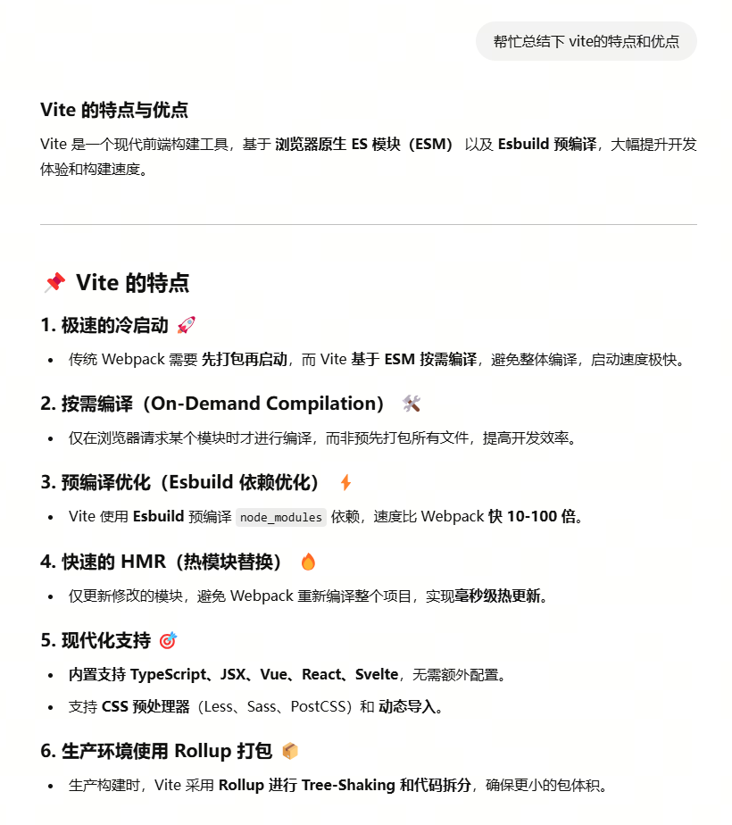
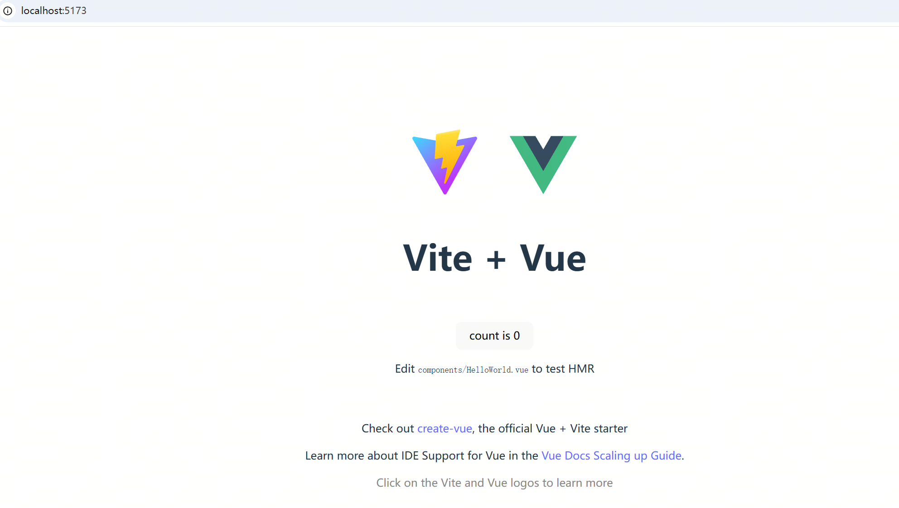
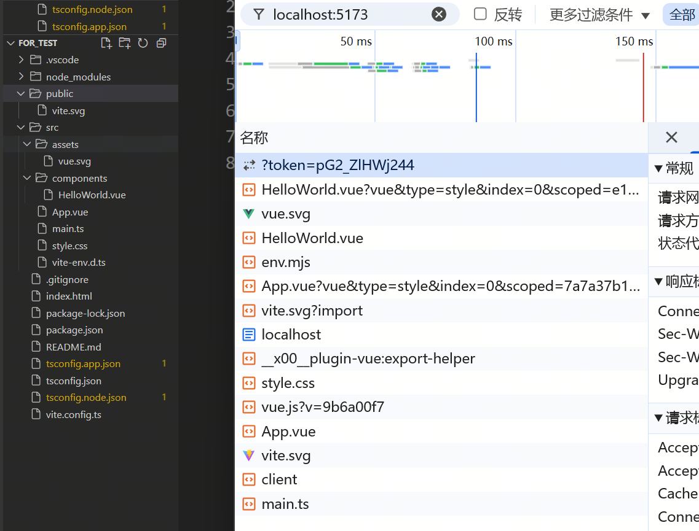
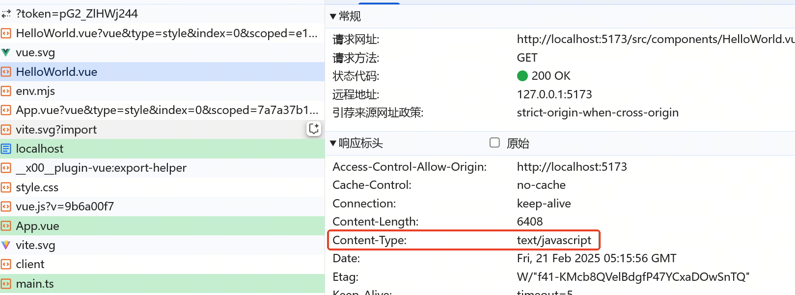
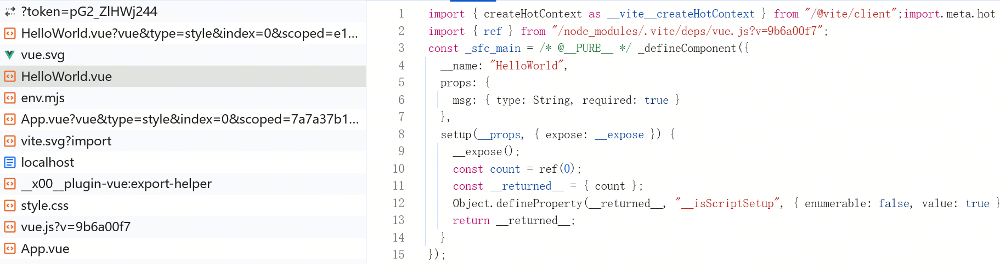

# 手搓 Vite：重拾前端工程化的仪式感  

> **有些事，不亲自动手，你永远不会知道它有多简单——或者多难！**  
> 今天，我们不做 Vite 的搬运工，而是尝试亲手造一个迷你版，巩固一下前端工程化的知识。  

## 📝 需求整理阶段  

在 ChatGPT 老师（以及它的八股文资料库）指导下，我们整理了一些 Vite 的基础功能。虽说这些知识点已经烂大街，但真正手写一遍，才算是自己的本事！  

### 🎯 我们计划实现的功能  

1. **开发环境**：使用 `esbuild` 进行编译，提升构建速度。  
2. **按需编译**：在开发模式下，不一次性打包所有文件，而是按需加载。  
3. **HMR（热模块替换）**：修改代码后，页面无感刷新，提高开发体验。  
4. **生产环境**：使用 `Rollup` 进行打包，确保代码优化和 Tree Shaking。  
5. **插件系统**：在 ChatGPT 老师的八股文基础上，加一个插件机制 😀  

# 开发环境设计：拆解 Vite 的核心思路  

> 我们打开真正的 Vite，参考它的实现，设计一个属于自己的开发环境！  

## 🚀 需求拆解  

我们围绕以下三个方向展开讨论：  

1. **开发模式启动**：浏览器能够请求资源并正确渲染页面。  
2. **多种资源支持**：浏览器能够加载 `.css`、`.png` 等各种类型的文件。  
3. **HMR（热模块替换）**：代码更新后，如何通知前端更新页面？  

## 🏗️ 启动开发模式  

在浏览器上，我们可以通过 `localhost:5173` 访问 Vite 启动的前端页面。但大家都知道，浏览器要访问 HTTP 资源，必须有个 HTTP 服务器（这不是废话吗……）。  

所以，第一步，我们需要**启动一个 HTTP 服务器**。可以用 `Node.js` + `Koa` 或 `Express` 搭建一个简单的 Server。  

## 📦 按需编译  

Vite 不是全量编译，而是**按需编译**。那么是不是可以在前端请求资源时，**加一个 middleware**，临时使用 `esbuild` 等工具对资源进行编译？  

## 🔍 观察资源请求  

打开调试工具，我们可以看到前端发出的所有请求，包括 `HelloWorld.vue` 和 `main.ts`。但我们知道，`.vue` 和 `.ts` 不能直接运行在浏览器里。  

查看请求详情，我们发现它们的 `response` 头部 `Content-Type` 是 `'text/javascript'`！  

**Vite 竟然欺骗了浏览器，让它以为这些资源就是 JS？**  

再看看 `style.css`，竟然也被编译成了 JS！（这点，我们之后详细再看）🤯  

### 🧐 结论  

Vite 会将**绝大部分文件**都编译为 JS，并通过 `Content-Type` 伪装成 JavaScript 文件。  
**换句话说，所有资源都是通过 ESM 方式加载的！**  

## 🔥 HMR：如何实现热更新？  

热更新（HMR）的关键步骤：  

1. **监测文件变化**：启动一个服务，监听所有文件是否有改动。  
2. **通知前端**：如果文件发生变化，发送一个消息给浏览器。  
3. **前端处理更新**：浏览器接收到消息后，重新加载变更的资源。  
4. **更新页面内容**：基于最新资源，运行逻辑，更新页面显示。  

👀 **第一步（监测文件变化）似乎最简单**，应该有对应的库可以直接拿来用 (●'◡'●)。  
但**第二步（如何通知前端）该怎么做呢？**  

---

我们知道，后端主动通知前端的常见方式有两种：  

1. **SSE（Server-Sent Events）**：浏览器发起**单向连接**，适用于简单消息推送。  
2. **WebSocket**：前后端**双向通信**，更适合实时交互。  

为了验证 Vite 用的是什么，我们打开了 DevTools 网络请求列表，果然发现了一个 **WebSocket 连接**！ 🎉  
（顺便一提，确实有一些 HMR 方案是基于 SSE 实现的。）  

  

但是……我们并没有手写 WebSocket 相关代码啊？  
它是怎么悄悄运行起来的？？ 🤯  

---

继续翻查请求详情，我们发现了几个有趣的点：  

- **浏览器请求了一个 `client` 相关的 JS 文件**，里面全是 WebSocket 连接代码。  
- **HTML 代码里多了一个 `<script>` 标签**，正是用来引入这个 `client` 文件的！  

💡 **推测：Vite 在返回 HTML 时，偷偷注入了一段 WebSocket 客户端代码，让前端自动连接 WebSocket！**  

那么，我们自己要实现的话，也可以这样做：  

1. **在后端实现 WebSocket 服务器**，监听文件变化并发送通知。  
2. **拦截 HTML 请求，给它偷偷加个 `<script>` 标签**，让前端自动运行 WebSocket 代码。  

接下来，我们可以动手设计具体实现，**让 HMR 只更新变更模块，而不是整个页面刷新！**  

未完待续~ 😆🚀  
