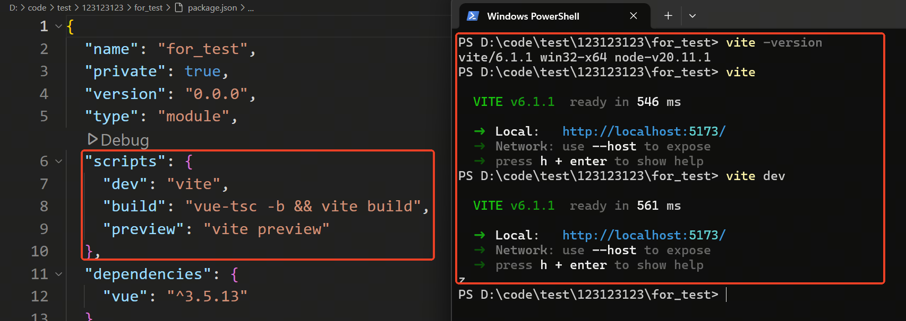
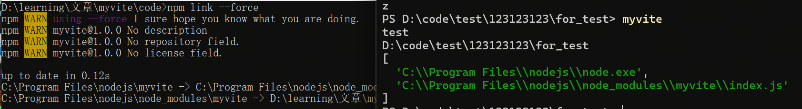
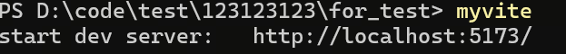
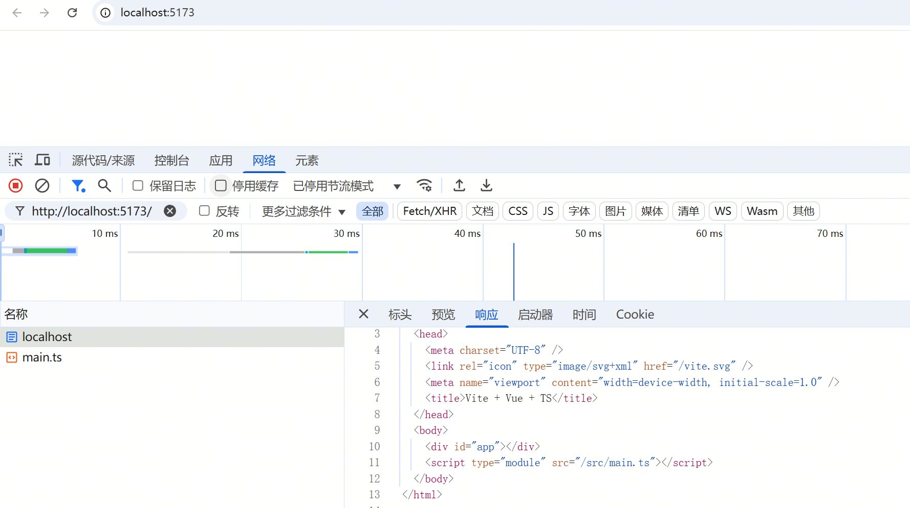
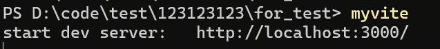

# 重新学习前端工程化：手搓 Vite(二)  

> **有些事，不亲自动手，你永远不会知道它有多简单——或者多难！**  
> 今天，我们不做 Vite 的搬运工，而是尝试亲手造一个迷你版，巩固一下前端工程化的知识。  

### 🎯 本次目标  

1. **命令行**：配置一个可以调用的命令行工具。  
2. **启动开发环境的 HTTP 服务**，让前端页面能跑起来。  
3. **配置处理**，支持vite的常用配置。  
  

## 命令行工具

我们知道，Vite 是有命令行工具的，常见的 `npm run dev` 本质上也是调用 `vite`。  
执行 `vite`，其实就是启动开发环境，也就是 `vite dev`。  
运行效果如下👇：  



### 🛠️ **手写一个 CLI**  

我们快速创建一个工程，并新增以下两个文件：  

``` javascript
// index.js
#!/usr/bin/env node

console.log('test')
console.log(process.cwd())
console.log(process.argv)
// 这里先简单输出下命令行的参数，用于测试
``` 

``` javascript
// package.json
{
  "name": "myvite",
  "version": "1.0.0",
  "description": "",
  "main": "index.js",
  "type": "module",
  "bin": {
    "myvite": "index.js"
  },
  "dependencies": {}
}
``` 

先执行 npm link。再执行 myvite 进行测试：



这样，我们的 CLI 就能跑起来了！🎉


## 🚀 开发 Vite 的开发环境服务  

### 📦 依赖安装  

在开发环境中，我们需要启动一个 HTTP 服务器，让前端页面能够跑起来。  
这里我们使用 **Koa** 作为服务器框架，并安装相关依赖：  

```bash
npm install koa --save
npm install koa-static --save
```
我们新建 `devServer.js` 文件，并写入以下代码：

``` javascript
// devServer.js
import Koa from 'koa'
import staticFiles from 'koa-static' // 静态资源使用的库
import http from 'node:http'

const hostName = 'localhost'
const port = 5173

const app = new Koa()

const createServer = () => {
  const server = http.createServer(app.callback())

  server.listen(port, hostName, () => {
    console.log(`start dev server:   http://${hostName}:${port}/`)
  })
}
export { createServer }

``` 
为了让 `myvite` 命令可以启动服务器，我们修改 `index.js`：

``` javascript
// index.js

#!/usr/bin/env node

const mode = process.argv[2] || 'dev'

if (mode === 'build') {
  // todo
} else if (mode === 'dev' || mode === 'serve') {
  const { createServer } = await import('./devServer.js')
  createServer()
} else {
  console.log('mode error')
}
```
🚀 启动开发服务器
现在，我们执行 myvite，就可以启动 HTTP 服务器了！ 🎉
运行效果如下👇：

💡 此时，服务器已经启动，但还不能访问静态资源。
🔜 接下来，我们来支持静态资源加载！




然后就是静态资源的获取了。  

在使用真正的 Vite 时，我们可以通过 `http://localhost:5173/` 访问 `index.html`，并通过 `http://localhost:5173/../...js`、`http://localhost:5173/../...css` 等路径访问其他资源。  

其中 `/../...js` 其实就是项目中的相对路径。  
那么，我们是不是可以直接获取项目的 **绝对路径**，然后将它配置为 `koa-static` 的 `root`，让 Koa 直接提供静态资源呢？  

我们修改如下代码👇  

### ✨ 修改 `devServer.js`
``` javascript
// devServer.js
const app = new Koa()

// 以下为修改内容
// 这里新增一个参数，由启动脚本将项目绝对路径传过来
const createServer = (root) => {
  app.use(
    staticFiles(root)
  )
// 以上为修改内容

  const server = http.createServer(app.callback())

``` 
``` javascript
// index.js
const app = new Koa()

// 以下为修改内容
const createServer = (root) => {
  app.use(
    staticFiles(root)
  )
// 以上为修改内容

  const server = http.createServer(app.callback())

``` 
我们重新运行项目，并在浏览器中访问 `http://localhost:5173/`。  



可以看到，不仅 `index.html` 能成功加载，连 `index.html` 中引用的 `main.ts` 也被成功获取。  
不过，由于 `main.ts` 仍是 TypeScript 代码，浏览器无法直接运行，因此会报一堆错误……😂  

最后，我们来处理 **配置**。  

在上面的代码中，我们直接把 `localhost` 和 `5173` 写死了。  
但在真正的 Vite 中，这些信息都是通过 **配置文件** 来管理的！  

接下来，我们简单实现一个 **读取配置** 的功能。  
### 🆕 新建一个用于生成配置的文件  

```javascript
// config.js
import { merge } from 'lodash-es'
import { pathToFileURL } from 'node:url'
import path from 'node:path'

const createConfig = async (root) => {
  const defaultConfig = {
    server: {
      hostName: 'localhost',
      port: 5173,
    },
    build: {
      // todo
    },
  }

  const myConfigName = 'myvite.config.js' // 这里可以配置多个，比如一个数组，然后遍历，找到第一个存在的配置文件
  const importConfig = (
    await import(pathToFileURL(path.join(root, myConfigName)).href)
  ).default

  // 将默认配置和导入配置合并
  const config = merge(defaultConfig, importConfig)
  return config
}

export { createConfig }

```
之后修改 `index.js` 和 `devServer.js`
```javascript
// index.js
const mode = process.argv[2] || 'dev'

// 以下为修改内容
import { createConfig } from './config.js'
const config = await createConfig(root)

if (mode === 'build') {
  // todo
} else if (mode === 'dev' || mode === 'serve') {
  const { createServer } = await import('./devServer.js')
// 以下为修改内容
  createServer(root, config)
```

```javascript
// devServer.js
const app = new Koa()

// 以下为修改内容
const createServer = (root, config) => {
  const { server: serverConfig } = config
  const { hostName, port } = serverConfig
// 以上为修改内容
```

接下来，我们新建一个 `myvite.config.js`，用于用户自定义配置。  
（这里不能用 `myvite.config.ts`，因为当前环境还未支持 TS 解析。会报不识别文件的错误。。。）  

然后，我们修改原有的代码，使其能够加载该配置文件。  

### 🆕 新建 `myvite.config.js`

```javascript
// myvite.config.js
import { defineConfig } from 'vite'
import vue from '@vitejs/plugin-vue'

// https://vite.dev/config/
export default defineConfig({
  server: {
    hostName: 'localhost',
    port: 3000,
  },
  plugins: [vue()],
})

```

重新运行项目后，我们发现端口确实被修改了！🎉  
这说明 `myvite.config.js` 配置已经生效，服务器成功监听了新的端口。  
可以在浏览器中访问新地址，例如：  




未完待续~ 😆🚀  
