# 重新学习前端工程化：手搓 Vite(三)  

> **有些事，不亲自动手，你永远不会知道它有多简单——或者多难！**  
> 今天，我们不做 Vite 的搬运工，而是尝试亲手造一个迷你版，巩固一下前端工程化的知识。  

### 🎯 本次目标  

1. **静态资源访问**  
   确保浏览器能够正确访问所需资源，并且资源的类型和内容符合预期。  

2. **esbuild 预构建**  
   模拟 Vite 使用 `esbuild` 进行预构建，提高开发环境的构建速度。  

3. **开发环境搭建**  
   搭建一个类似 Vite 的开发环境，能够正常渲染页面，实现基本功能。  

## HTML 文件处理

HTML 是浏览器访问的第一个资源，咱们得先把它安排妥当。  
先来看下 Vite 运行环境中的 HTML 文件：  

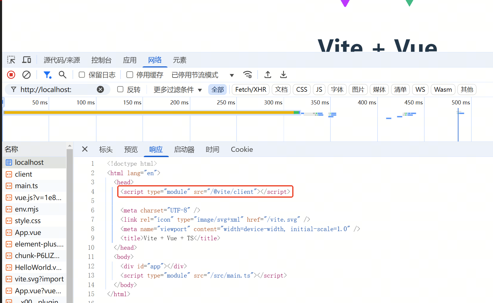  

在最初的需求整理中，我们提到，如果要实现 HMR（热模块替换），需要让 HTML 加载并运行我们的自定义 JavaScript 文件。  

为此，我们在 `devServer.js` 里加上一个中间件，拦截 HTML 请求，并通过字符串替换，让它按我们的需求加载额外的 JS 代码。  

如果对 Koa 中间件不太熟，可以参考官方文档：[Koa Middleware](http://pauli.cn/koa-docs-1x/#middleware)。  

这样，我们的 HTML 处理逻辑就初步完成了！🚀  

``` javascript
// devServer.js

import path from 'node:path'
import fs from 'node:fs'

const CLIENT_FILE = 'client.js'
const CLIENT_PATH = `/@myvite/${CLIENT_FILE}`

function getContent(ctxBodyStream) {
  // 将流转换为字符串
  return new Promise((resolve) => {
    let res = ''

    if (typeof ctxBodyStream === 'string') {
      resolve(ctxBodyStream)
    } else {
      ctxBodyStream.on('data', (chunk) => {
        res += chunk
      })
      ctxBodyStream.on('end', () => {
        resolve(res)
      })
    }
  })
}

async function modifyHtml(ctx) {
  // 修改html内容，添加客户端脚本
  ctx.body = (await getContent(ctx.body)).replace(
    /<\/head>/,
    `<script type="module" src="${CLIENT_PATH}"></script>\n<\/head>`)
}

async function modifyResponse(ctx) {
  // ctx.body
  const uri = ctx.request.url.split('?')[0]

  if (ctx.response.is('html')) {
    await modifyHtml(ctx)
  } else if (ctx.request.url === CLIENT_PATH) {
    ctx.set('Content-Type', 'text/javascript')
    ctx.body = await fs.promises.readFile(path.join(__dirname, CLIENT_FILE))
  }
}

const createServer = (root, config) => {
  const { server: serverConfig } = config
  const { hostName, port } = serverConfig

  // 使用koa中间件，处理所有请求，并对静态资源做相应的处理
  app.use(async (ctx, next) => {
    await next()
    await modifyResponse(ctx)
  })

``` 

别忘了整一个 `client.js`，不然页面可要炸了 💥！  

``` javascript
// client.js

// 先不添加有用的逻辑
console.log("just test")
``` 

目前为止，一切顺利运行！🚀

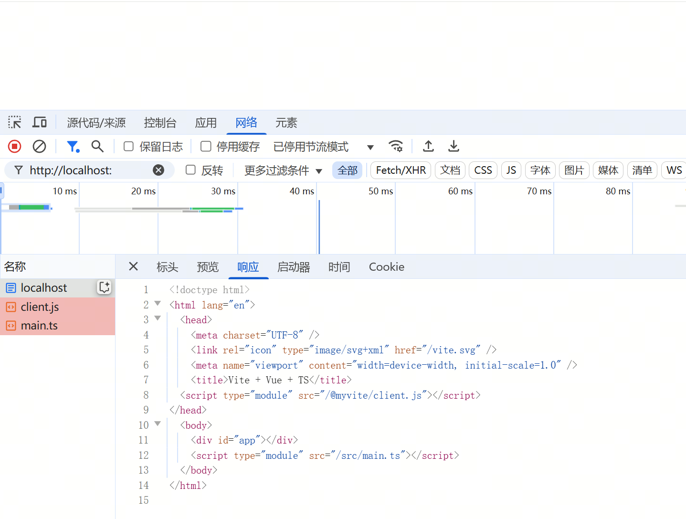

## JS、TS 文件处理  

目前 `main.ts` 里还没用到任何 TypeScript 语法，所以暂且把它当作普通的 JS 文件来看待。  
先来看看当前 `main.ts` 的运行情况：  

首先，迎面而来一个错误 ❌  
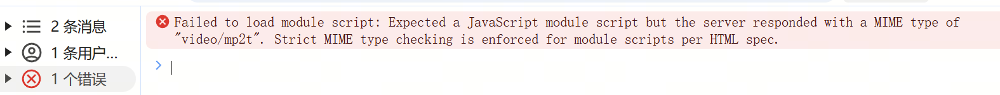  

再仔细一瞧，问题出在 `Content-Type` 上：  
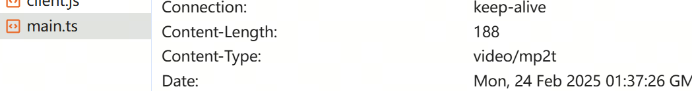  

浏览器收到的 `Content-Type` 是个不支持的类型，所以摆烂了。。  
我们只需要在对应请求的中间件里，调整 `Content-Type` 就可以  

``` javascript
// devServer.js

async function modifyTs(ctx) {
  ctx.set('Content-Type', 'text/javascript')
}

async function modifyResponse(ctx) {
  // ctx.body
  const uri = ctx.request.url.split('?')[0]

  if (ctx.response.is('html')) {
    await modifyHtml(ctx)
  } else if (uri === CLIENT_PATH) {
    ctx.set('Content-Type', 'text/javascript')
    ctx.body = await fs.promises.readFile(path.join(__dirname, CLIENT_FILE))
  } else if (uri.endsWith('.ts')) {
    await modifyTs(ctx)
  } else if (uri.endsWith('.js')) {
    await modifyTs(ctx)
  }
}
``` 

再看看 `main.ts`，这里的 `import { createApp } from 'vue'`  
我们真的有 `vue` 这个资源吗🤔？  

就算我们通过配置，把 `vue` 指向 `node_modules` 里的 `vue`，但 Vue 源码里那么多文件，难道要浏览器一个个请求？  

于是，我们回到 Vite，看看它是怎么做的：  

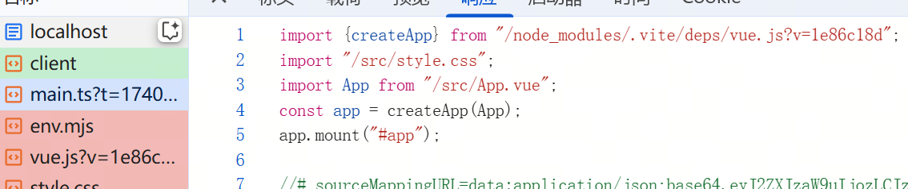  

发现它请求的是：  
`/node_modules/.vite/deps/vue.js?v=1e86c18d`  

这似乎是 Vite 自己维护的文件？  
我们深入 `node_modules/.vite/deps` 目录，果然如我所料！  

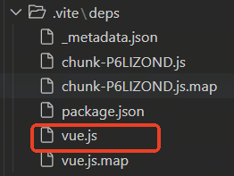  

看起来，Vite 在启动时，会先收集所有依赖的库，把它们编译成 JS 文件，存储在自己的目录中。  
然后，在页面 `import` 时，动态修改引用路径，让它访问这些预先编译好的文件。  

为了验证我们的猜想，我们在测试项目里加入 `element-plus`，并加个按钮试试：  

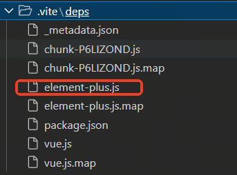  

结果完全符合预期 🎯！  

这就是 Vite 依赖预构建的核心逻辑——让第三方依赖更快、更高效地被加载。🚀  

## 实现依赖预构建

要实现依赖预构建，我们需要完成以下几步：  

1. **依赖收集** ：递归遍历项目中的所有 JS 文件，找出所有 `import` 进来的依赖。  
2. **编译依赖库** ：对收集到的依赖进行编译，并存储到指定目录。  
3. **重写 `import`** ：将 JS 代码中的 `import` 语句修改，使其指向编译后的资源路径。  

### 依赖收集  

这里我们使用 `es-module-lexer`，它可以帮助我们从 JS 文件中提取 `import` 的模块路径。  
于是，我们新建了一个 `optimize.js`，专门用于分析和收集依赖。  


``` javascript
// optimize.js

// 负责收集所有的依赖服务，并使用esbuild进行编译，编译结果存储到一个固定文件夹中，等待html等引用
import path from 'node:path'
import fs from 'node:fs'
import { parse } from 'es-module-lexer'
import { build } from 'esbuild'
import { OPTIMIZER_PATH } from './config.js'

const initOptimizer = async (filePath) => {
  let allModules = [] // 收集裸模块集合
  const files = await fs.promises.readdir(filePath)
  for await (const fileName of files) {
    const file = path.join(filePath, fileName)
    const data = await fs.promises.stat(file)
    if (data.isDirectory()) {
      // 递归文件夹收集依赖
      allModules = allModules.concat(await initOptimizer(file))
    } else if (['.ts', '.js'].includes(path.extname(fileName))) {
      // 调用库 'es-module-lexer' 收集用到的依赖
      // 这里暂时没有直接收集 .vue 文件的内容，直接调用 parse 方法会报错
      const content = (await fs.promises.readFile(file)).toString()
      const imports = parse(content)[0]
      const modules = imports
        .map((item) => item.n)
        .filter((item) => !/^(\.|\/)/.test(item))
      allModules = allModules.concat(modules)
    }
  }
  return [...new Set(allModules)]
}

const createOptimizer = async (root) => {
  const ret = await initOptimizer(path.join(root, 'src'))
  console.log(ret)
}

export { createOptimizer }

```

别忘了在 `index.js` 里调用它，让它在 Vite 启动时自动运行！  

``` javascript
// index.js

} else if (mode === 'dev' || mode === 'serve') {
  const {createOptimizer} = await import('./optimize.js')
  createOptimizer(root)

  const { createServer } = await import('./devServer.js')
  createServer(root, config)
} else {
```

测试一下

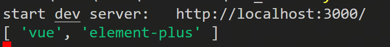

呦，不错哦


不过目前还没支持 `.vue` 文件，因为 `.vue` 里面包含模板、CSS 等内容，直接分析会报错。

等到看完这个文档，看看大家有没有办法来解决这个问题吧

### 编译依赖库  

那我们该用什么工具来编译呢？  

又到了八股文时间——Vite 开发环境里使用的正是 **esbuild**！  

作为一名 **高级全栈工程师**，我可能不太熟 `esbuild`。  
但作为一名 **资深 面向 ChatGPT CV 工程师**，我能够熟练使用 `esbuild`，并且精通其原理！（lll￢ω￢）  

``` javascript
// optimizer.js
const OPTIMIZER_PATH = '/node_modules/.myvite/deps'

const buildOptimizer = (filePath, modules) => {
  build({
    // 设置构建的绝对工作目录，指向项目的根目录。
    absWorkingDir: filePath,
    // 定义入口文件。modules 应该是一个数组，包含项目的入口模块路径。
    entryPoints: modules,
    // 设置为 true 表示将所有依赖打包到一个或多个输出文件中。
    bundle: true,
    // 指定输出的模块格式，esm 表示输出为 ES 模块。
    format: 'esm',
    // 启用代码分割功能，允许将代码拆分为多个文件，以优化加载性能。
    splitting: true,
    // 指定输出目录。
    outdir: OPTIMIZER_PATH,
    // 用于定义全局变量。这里定义了两个 Vue.js 相关的全局变量
    define: {
      // 设置为 'true'，表示启用 Vue 的 Options API
      __VUE_OPTIONS_API__: 'true',
      // 设置为 'true'，表示在生产环境中启用 Vue Devtools
      __VUE_PROD_DEVTOOLS__: 'true',
    }
  })
}

const createOptimizer = async (root) => {
  const ret = await initOptimizer(path.join(root, 'src'))
  buildOptimizer(root, ret)
}
```

测试下，完美

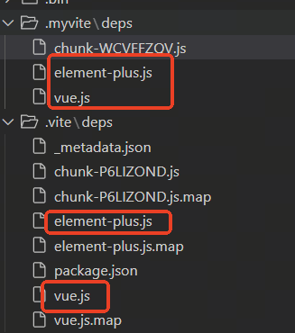

### 重写 `import`  

接下来，我们要修改 `modifyTs`，封装一个新的函数，用于替换 JS 代码中的 `import` 路径，让它们指向预构建的资源。  

``` javascript
// devServer.js

function modifyImport(content) {
  // 修改 import 
  // 对于外部依赖，引用 .myvite/deps/ 下的
  // 对于相对路径的引用，改成针对root的绝对路径
  // 这里只写了两个case。还有很多都可以补充，比如 png 等图片的使用。alias 中 '@' 的转换等

  const imports = parse(content)[0]
  const magicSting = new MagicSting(content)
  for (const item of imports) {
    if (!/^(\.|\/)/.test(item.n)) {
      // 例如 import { createApp } from 'vue'
      const { n, s, e } = item
      magicSting.overwrite(s, e, `${OPTIMIZER_PATH}/${n}.js`)
    } else if (/.(vue|css)/.test(item.n) && item.n.startsWith('.')) {
      // 例如 import App from './App.vue'
      // 需要修改为相对路径
      const { s, e } = item
      let { n } = item
      if (n.startsWith('.')) {
        n = n.replace('./', '')
      }
      magicSting.overwrite(s, e, `/src/${n}`)
    }
  }
  return magicSting.toString()
}

async function modifyTs(ctx) {
  ctx.set('Content-Type', 'text/javascript')

  ctx.body = modifyImport(await getContent(ctx.body))
}

```

最终测试，成功

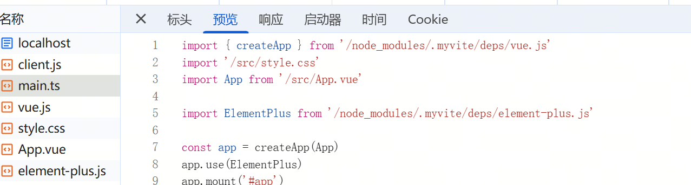

可以看到，引用的资源数量已经和真正的 Vite 非常接近了！🎉  


现在，我们重新看看页面上的报错信息：  

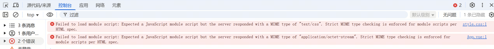  

出现这些问题的原因是 —— 在 Vue 项目中，`.css` 和 `.vue` 文件都是允许通过 `import` 语句引入的。  
但如果直接 `import`，浏览器不认识这些文件类型，又摆烂了。。。  

接下来，我们就来解决这个问题！  


## css文件处理

CSS 不能直接 `export`，也不能像 JS 一样被 `import` 进来执行。  
但我们可以换个思路 —— **把 CSS 代码转成字符串**，然后动态创建 `<style>` 标签插入到 HTML 里，这不就行了？🧐  

``` javascript
const cssString = "div {height: 100%;}"

const styleElement = document.createElement('style')
styleElement.setAttribute('type', 'text/css')
styleElement.textContent = cssString
document.head.append(styleElement)

```

不过，这几行代码难道要每个 CSS 文件都手写一遍？这也太累了吧。。 

还记得我们之前注入的 `client.js` 吗？✨  
我们可以把这坨逻辑挪进去，让它自动帮我们处理 CSS！💡  

``` javascript
// clien.js
const updateStyle = (content) => {
  const style = document.createElement('style')
  style.setAttribute('type', 'text/css')
  style.textContent = content
  document.head.append(style)
}
export { updateStyle }

```

``` javascript
// 测试用css test.css
import {updateStyle} from "/@myvite/client"
const cssString = "div {height: 100%;}"

updateStyle(cssString)
```

我们需要在 Koa 的中间件里专门处理 CSS 文件请求。  

``` javascript
// devServer.js
async function modifyCss(ctx) {
  ctx.set('Content-Type', 'text/javascript')
  const content = await getContent(ctx.body)
  const code = [
    `import { updateStyle } from "${CLIENT_PATH}"`,
    `const cssContent = ${JSON.stringify(content)}`,
    `updateStyle(cssContent)`,
  ].join('\n')
  ctx.body = code
}

async function modifyResponse(ctx) {
  ...
  } else if (ctx.request.url.endsWith('.js')) {
    await modifyTs(ctx)
  } else if (uri.endsWith('.css')) {
    await modifyCss(ctx)
  }
```

## vue文件处理

熟悉 Vue 的同学都知道，`.vue` 文件通常包含三部分：  

- `<script>` 👉 编译成 **SFC**（单文件组件）  
- `<template>` 👉 编译成 **render 函数**，作为 SFC 的一部分  
- `<style>` 👉 存放 CSS，不能直接在 JS 中运行  

那怎么让浏览器正确解析 `.vue` 文件呢？🤔  

### 方案设计  

1. **解析 `.vue` 文件**，拆分出 `script`、`template` 和 `style` 三部分。  
2. **将 `template` 编译成 `render` 函数**，合并到 SFC 组件里。  
3. **提取 `style` 代码**，像之前 CSS 处理那样，转成单独的 `.css` 文件，并在 SFC 里 `import` 进来。  

### 依赖工具  

这里我们用到 Vue 官方提供的 `@vue/compiler-sfc`，它专门用于编译 `.vue` 文件。  

主要涉及三个核心函数：  

- **`parse`** 👉 解析 `.vue` 文件，拆分成 `script.content`、`template.content`、`styles.content` 三部分。  
- **`compileTemplate`** 👉 把 `template.content` 编译成 `render` 函数。  
- **`compileScript`** 👉 把 `script.content` 编译成 SFC 组件代码。  


``` javascript
// devServer.js
async function modifyVueToJs(ctx, url) {
  const fileName = ctx.request.url.split('/').pop()

  ctx.set('Content-Type', 'text/javascript')

  const content = await getContent(ctx.body)

  const { descriptor } = vueParse(content, { filename: fileName })

  let code = []
  if (descriptor.styles.length) {
    // 如果当前文件有style。就加一句import css的逻辑
    code.push(`import "${url}?type=style&index=0&scoped=7a7a37b1&lang.css"`)
  }
  
  // 编译sfc
  const vueScriptCode = compileScript(descriptor, {
    source: descriptor.scriptSetup.content
  }).content

  // 编译rander
  const vueTemplateCode = compileTemplate({
    source: descriptor.template.content,
    filename: fileName,
  }).code

  code = [
    ...code,

    // 由于上边编译结果 sfc 不包含 rander。所以做以下处理
    vueScriptCodeJs.replace(
      'export default',
      `const main =`
    ),
    vueTemplateCode,
    `main.render = render`,
    `export default main`,
  ].join('\n')

  ctx.body = modifyImport(code)
}

async function modifyVueToCss(ctx) {
  ctx.set('Content-Type', 'text/javascript')

  const content = await getContent(ctx.body)

  const { descriptor } = vueParse(content)

  const cssContent = descriptor.styles.reduce(
    (init, item) => init + item.content,
    ''
  )

  ctx.set('Content-Type', 'text/javascript')
  const code = [
    `import { updateStyle } from "${CLIENT_PATH}"`,
    `let css = ${JSON.stringify(cssContent)}`,
    `updateStyle(css)`,
  ].join('\n')
  ctx.body = code
}

async function modifyResponse(ctx) {
  ...
  } else if (uri.endsWith('.vue') && !ctx.request.url.includes('?type=style')) {
    // 这里判断 vue 文件的方法，写的比较简单。vite有单独封装大量的工具函数
    await modifyVueToJs(ctx, ctx.request.url)
  } else if (uri.endsWith('.vue') && ctx.request.url.includes('?type=style')) {
    await modifyVueToCss(ctx)
  }
```

改完之后，我们测试了一下，发现了一个 **新问题**：  

由于我们创建的是一个 **TypeScript 项目**，Vue 组件的 `<script setup lang="ts">` 代码被编译成了 TS。  
但浏览器 **不能直接运行 TS**，于是报错了：  

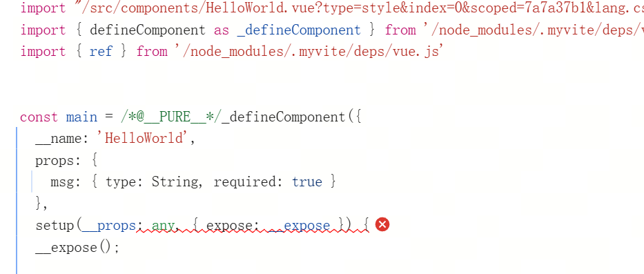  

### 怎么把 TS 转成 JS？Babel？TSC？  
不行！还记得八股文里 **Vite 开发环境的编译器** 是啥吗？  

**我们要先看看 `esbuild` 能不能支持！**  

于是，我们修改 SFC 的编译逻辑，额外加上 **TS 转 JS 的步骤**。  

``` javascript
// devServer.js

  const vueScriptCodeTs = compileScript(descriptor, {
    source: descriptor.scriptSetup.content
  }).content

  const vueScriptCodeJs = transformSync(vueScriptCodeTs, {
    loader: 'ts',
    target: 'esnext'
  }).code
  // 上边处理 ts、js的时候没有这个处理。是由于我们的main.ts中没有ts语法，所以当时偷懒了。。。。
```

好家伙，接下来有请下一个错误

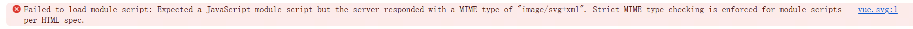

这次，是因为我们 `import` 了一个 **SVG 文件**。  
但是浏览器 **并不支持直接 import SVG**，于是它炸了。💥  

## svg文件处理

不同状况下，Vite 处理 SVG 的方案很多，很复杂

这里，我们简单粗暴地 **对所有 SVG 资源都采用同一种方式**：  

 **转换为 Data URI**（Base64 编码）  
 **将其作为字符串 `export default` 出去**  

``` javascript
// devServer.js

async function modifySvg(ctx) {
  ctx.set('Content-Type', 'text/javascript')
  const content = await getContent(ctx.body)
  const code = [
    `export default "data:image/svg+xml,`,
    encodeURIComponent(content),
    `"`,
  ].join('')
  ctx.body = code
}

async function modifyResponse(ctx) {
  ...
  } else if (uri.endsWith('.svg')) {
    await modifySvg(ctx)
  }
}

```

我们终于页面看到东西了。。。。*★,°*:.☆(￣▽￣)/$:*.°★* 。

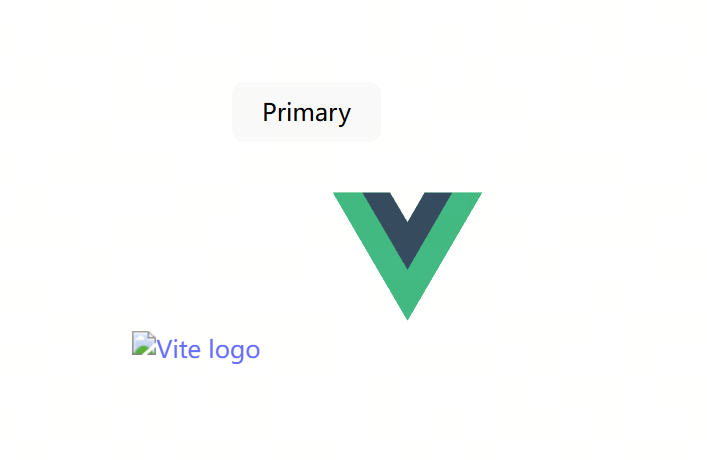

在测试过程中，我们发现 **`/vite.svg` 仍然无法加载**。  

**原因**：这个文件 **并不存在于我们的测试工程里**，而是 **Vite 自带的 Logo**。  

所以，这个问题需要 **单独处理**，  

**有兴趣的小伙伴，可以自己试试！**  

## 子组件处理

最后一个错误了

我们的测试项目里有一个 `HelloWorld` 组件，但是 **只有父组件被成功渲染**  

我们打开 `console`，发现了如下 **警告**：  

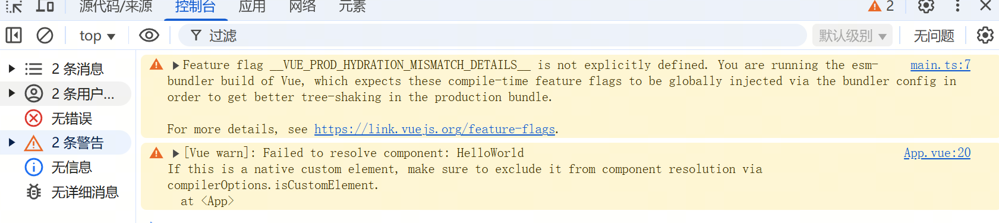

这个错误 **直接给我们指明了调查方向**！ 

于是，我们查看 `App.vue` 编译后的 `render` 函数。  

这里东西比较多，我删除了一些没用的代码

``` javascript
import HelloWorld from "/src/components/HelloWorld.vue";
const main = /* @__PURE__ */ _defineComponent({
  __name: "App",
  setup(__props, { expose: __expose }) {
    __expose();
    const __returned__ = { HelloWorld };
    Object.defineProperty(__returned__, "__isScriptSetup", { enumerable: false, value: true });
    return __returned__;
  }
});

import { createTextVNode as _createTextVNode, resolveComponent as _resolveComponent, withCtx as _withCtx, createVNode as _createVNode, createElementVNode as _createElementVNode, Fragment as _Fragment, openBlock as _openBlock, createElementBlock as _createElementBlock } from "/node_modules/.myvite/deps/vue.js"

export function render(_ctx, _cache) {
  const _component_el_button = _resolveComponent("el-button")
  const _component_HelloWorld = _resolveComponent("HelloWorld")

  return (_openBlock(), _createElementBlock(_Fragment, null, [
    // 省略无用代码。。。
    _createVNode(_component_HelloWorld, { msg: "Vite + Vue" })
  ], 64 /* STABLE_FRAGMENT */))
}
main.render = render
export default main
```

我们查看 `render` 函数，发现 Vue **调用了 `resolveComponent`** 来获取 `HelloWorld` 组件。  
那么，**`resolveComponent` 是怎么工作的？**   

为了搞清楚，我们翻了一下源码

以下参考自 vue:3.5.6 文件路径 core/packages/runtime-core/src/helpers/resolveAssets.ts

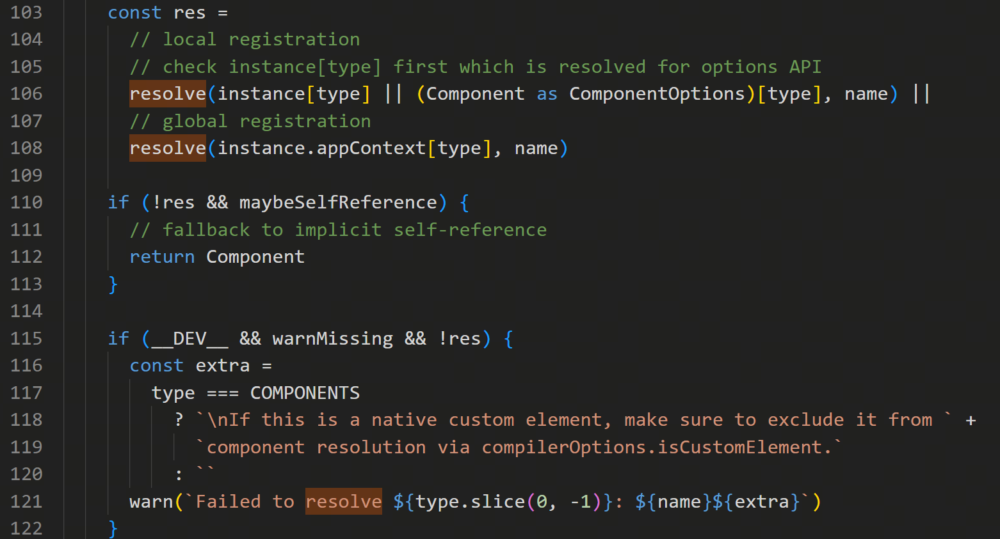

**下方的警告，和实际效果完全对应！**

从 Vue **源码分析** 来看，`resolveComponent` **解析组件的方式** 是：  

1. **先查找当前实例的已注册组件**   
2. **如果找不到，再去全局注册的组件列表里查找**   

对于vue3来说，有以下几种注册方法

``` javascript

const app = createApp(App)
app.component('HelloWorld', HelloWorld) // 全局注册组件

export default {
  components: {
    HelloWorld // 选项式api
  }
}

const HelloWorld = defineComponent(HelloWorld) // 组合式api
```
这也就是为什么类似的代码 el-button 就没有问题。因为在main.ts 里注册到全局了

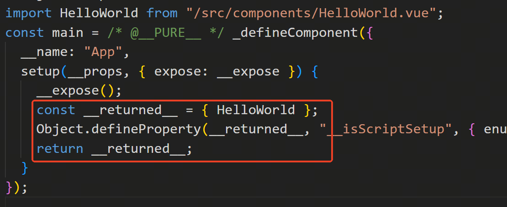

**回顾当前的编译结果**  

从 `setup` 返回的结果来看，**`HelloWorld` 组件已经被 `sfc` 的 `setup` 返回**

所以我们猜测下  **我们应该直接从 `sfc` 对象获取组件，而不是依赖 `resolveComponent`。**

查阅相关资料，对 modifyVueToJs 函数做一下修改

``` javascript
// devServer.js

  const { content: vueScriptCode, bindings } = compileScript(descriptor, {
    source: descriptor.scriptSetup.content
  })

  const vueTemplateCode = compileTemplate({
    source: descriptor.template.content,
    filename: fileName,
    compilerOptions: { bindingMetadata: bindings } // 新增配置
  }).code

```

之后请看最终结果

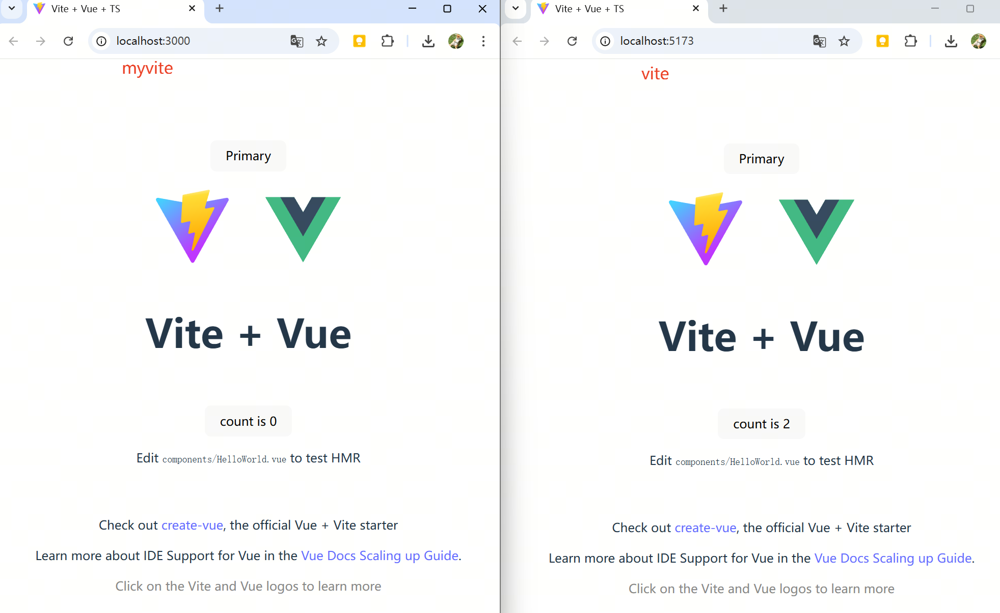


未完待续~ 😆🚀  
