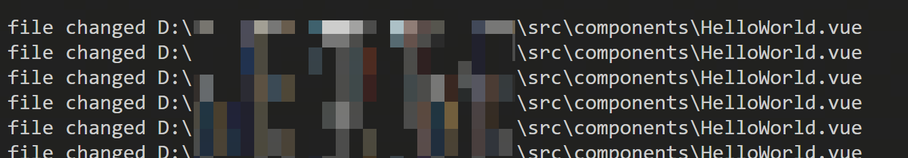
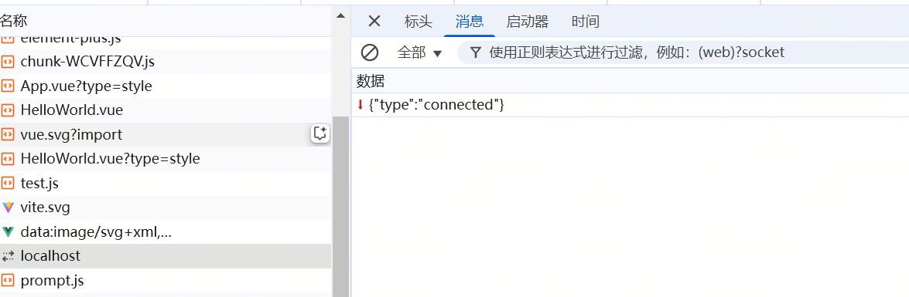
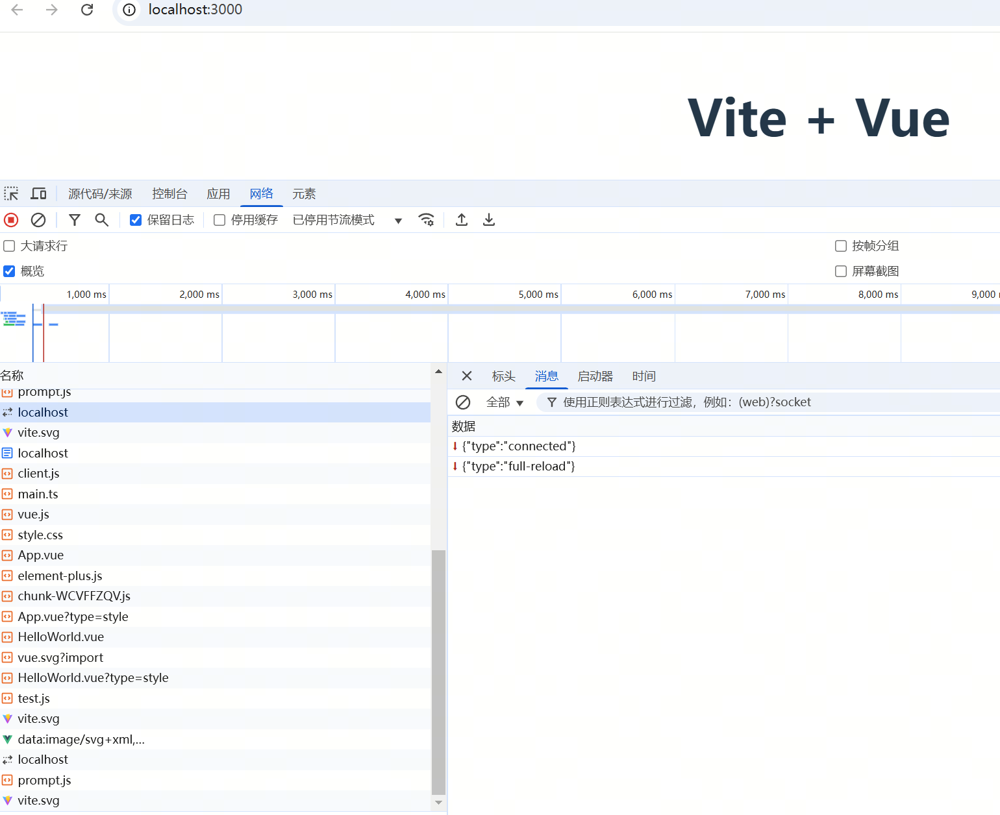
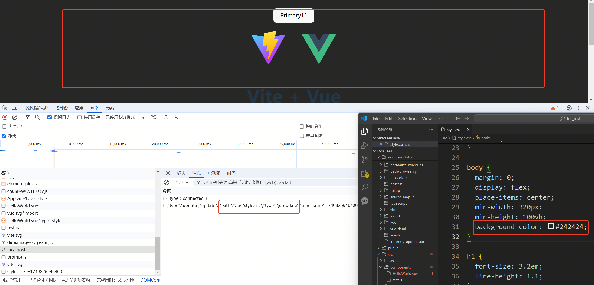
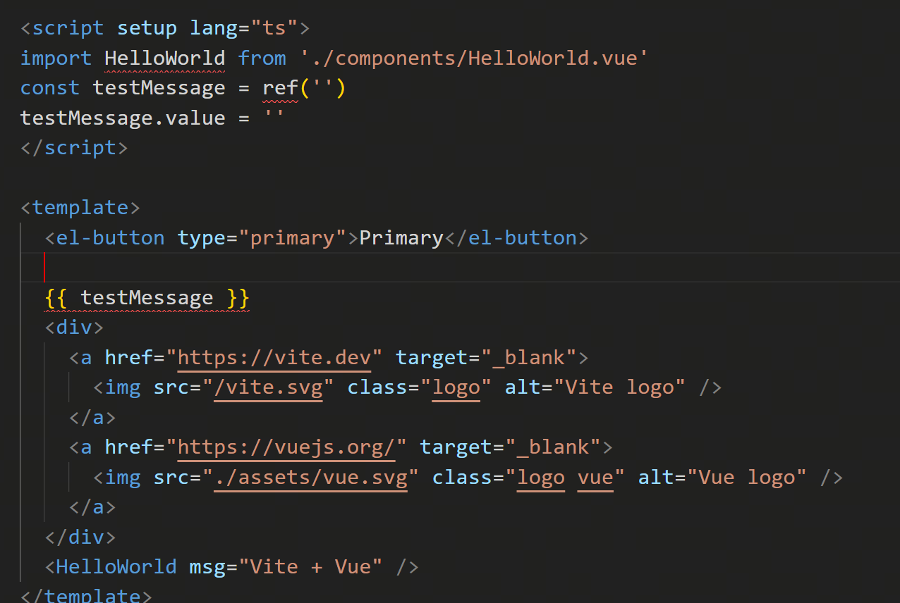

# 重新学习前端工程化：手搓 Vite(三)  

> **有些事，不亲自动手，你永远不会知道它有多简单——或者多难！**  
> 今天，我们不做 Vite 的搬运工，而是尝试亲手造一个迷你版，巩固一下前端工程化的知识。  

### 🎯 本次目标  

1. **HMR**  
   实现文件热更新，在开发环境编辑文件时，不需要手动刷新页面，极可能新内容  

## HMR 基本原理

我们首先明确下文件热更新的原理
主要分为以下几步

1.监测开发环境文件修改
2.当文件修改后，通知打开的浏览器文件发生变化
3.当变化的文件不支持热更新时，自动刷新页面
4.如果变化的文件支持热更新，则自动重新请求变化的资源
5.根据变化的文件类型，执行相关逻辑，在不刷新页面的情况下，将页面效果修改为改动后的样子

## 监控文件是否发生变化

这里我们用到一个库 chokidar
我们新建一个文件 hmr.js
``` javascript
// hmr.js

import path from 'node:path'
import chokidar from 'chokidar'

function createHmr(root) {
  chokidar
    .watch(path.join(root), { ignoreInitial: true })
    .on('change', (file, status) => {
      // 这里先测试
      console.log('file changed', file)
    })
}

export { createHmr }
``` 
之后再 index.js 中调用它
``` javascript
// index.js

} else if (mode === 'dev' || mode === 'serve') {
  const { createHmr } = await import('./hmr.js')
  createHmr(root)
} else {

``` 

测试下

异常简单 (●ˇ∀ˇ●)

## 通知浏览器文件变化

经常背八股文的兄弟们应该都知道，常用的后端主动发消息给前端的方法就两个 webSocket 和 sse
今天我们使用webSocket来实现

我们再hmr.js中做以下修改

``` javascript
// hmr.js

import { WebSocketServer } from 'ws'
import { analysisJsFromVue, analysisCssFromVue } from './plugins/vue.js'
import fs from 'node:fs'

// 在已有的http服务上创建一个 websocket 服务
const createWebSockerServer = (root, server) => {
  const wss = new WebSocketServer({
    server,
  })
  wss.on('connection', (ws) => {
    ws.send(JSON.stringify({ type: 'connected' }))
  })
  createHmr(root, wss)
}

// 文件变化的回调函数
function onfileChange(file, wss) {
  const wsContent = { type: 'update' }

  wss.clients.forEach((client) => {
    if (client.readyState === 1) {
      client.send(
        JSON.stringify(wsContent)
      )
    }
  })
}

// 监测文件变化
function createHmr(root, wss) {
  chokidar
    .watch(path.join(root), { ignoreInitial: true })
    .on('change', (file, status) => {
      console.log('file changed', file)
      onfileChange(file, wss)
    })
}

export { createWebSockerServer }
``` 

之后，我们先删除之前在 index.js中启动的文件监听服务，改为移动到 devServer.js
``` javascript
// devServer.js

import { createWebSockerServer } from './hmr.js'

const createServer = (root, config) => {

  server.listen(port, hostName, () => {
    console.log(`start dev server:   http://${hostName}:${port}/`)
    createWebSockerServer(root, server)
  })
}

```

但是这里，我们只是新建了服务端，还需要再浏览器上启动一个 websocket 客户端才行
这里可以借助我们之前的 client.js

``` javascript
// client.js
const host = new URL(import.meta.url).host
let ws = new WebSocket(`ws://${host}`)
ws.addEventListener('message', ({ data }) => {
  console.log(data)
})

```

测试下


很顺利 (*^_^*)

## 前端自动刷新

我们继续下一步
当一个文件变化时，我们要通知浏览器文件发生变化
之后浏览器需要自动刷新

我们完善下之前的hmr.js和client.js

``` javascript
// hmr.js

// 文件变化的回调函数
function onfileChange(file, wss) {
  // 这里应该判断文件得类型，比如
  // tsconfig.json 需要重启服务
  // vite.config.ts 需要重启服务
  // 。。。

  let wsContent = {
    type: 'full-reload', update: {
      path: hotModules.get(file),
      type: 'js-update',
      timestamp: Date.now()
    }
  }
  wss.clients.forEach((client) => {
    if (client.readyState === 1) {
      client.send(
        JSON.stringify(wsContent)
      )
    }
  })
}

``` 
``` javascript
// client.js

// 热更新的客户端
class HMRClient {
  constructor() {
    this.initWebSocket()
  }

  initWebSocket() {
    const host = new URL(import.meta.url).host
    let ws = new WebSocket(`ws://${host}`)
    // ws.addEventListener('open', () => {}, { once: true })
    ws.addEventListener('message', async ({ data }) => {
      await this.handleMessage(JSON.parse(data))
    })
  }

  async handleMessage(data) {
    switch (data.type) {
      case 'full-reload':
        window.location.reload()
        break
    }
  }

}

const hmrClient = new HMRClient()

``` 

测试下效果

打开页面，之后修改下文件， 暗中观察下。。。



目前为止一切顺利。。

## 收集需要HMR的文件

之后我们要思考下，哪些文件可以支持 热更新

我们的测试项目是vue，所以今天先只讨论vue项目了。。

首先 配置文件相关，比如 tsconfig.js vite.confid.js
这些文件修改后，项目中可能大量文件涉及重新编译，那这样的话，热更新是不是就没意义了。。
并且如果 vite.confid.js 中的 host和port被修改，可能还涉及重新启动http服务的问题。所以以上不在今天的考虑范围内

然后是html文件。这个也是不能支持热更新的，这个稍微容易理解。。。

css文件，上一篇文章中，我们是将css文件转成了字符串，并拼在一断js中返回给浏览器的。浏览器收到后，回创建一个style标签，并将css代码写入。
这里，我们是不是只需要找到css文件对应的那个标签，并将他修改成新的版本就可以实现了。。那么认为css可以支持热更新

.vue 文件。我们知道，vue在渲染dom的时候，是通过rander函数实现的。那么我们是不是只需要重新运行下 vue rander函数就可以了？
不过，这里需要额外注意以下。如果vue修改的内容，不只是template。例如以下
``` javascript
const test = ref(0) => ref(1)
test.value = 2
``` 
这种情况，在我们修改代码时，test的值，已经被修改了。这时，我们不能将test的值重置为代码修改后的版本 1。而是保持test现有的值2.之后再执行rander函数
型号，vue官方都有现成的插件供我们使用。。。

最后我们需要考虑下 普通的 js、ts 文件。
支持hmr。很重要一个条件，是需要文件支持 幂等。但是由于普通的js、ts 文件功能各异。一般的脚手架，都不支持对普通js、ts 文件的热更新


这里我们 新增了一个map，当前端请求一个新的资源时，如果它支持hmr（.css或.vue）。我们把他缓存在这个map中
当这些文件变化时，不要通知前端reload，而是通知浏览器update


``` javascript
// hmr.js
const hotModules = new Map()


function createHmr(root, wss) {
  chokidar
    .watch(path.join(root), { ignoreInitial: true })
    .on('change', (file, status) => {
      console.log('file changed', file)
      if (hotModules.has(file)) {
        onfileChange(file, wss)
      } else {
        // 不支持 HMR 的话，直接刷新就好
        wss.clients.forEach((client) => {
          if (client.readyState === 1) {
            client.send(JSON.stringify({ type: 'full-reload' }))
          }
        })
      }
    })
}

export { createWebSockerServer, hotModules }
``` 

之后，在浏览器请求资源的时候，把这些请求收集起来

``` javascript
// devServer.js
import { createWebSockerServer, hotModules } from './hmr.js'

async function modifyResponse(ctx) {

  } else if (uri.endsWith('.css')) {
    await modifyCss(ctx)
    hotModules.set(path.join(ROOT, ctx.request.url), ctx.request.url)
  } else if (uri.endsWith('.vue') && !ctx.request.url.includes('?type=style')) {
    await modifyVueToJs(ctx, ctx.request.url)
    hotModules.set(path.join(ROOT, ctx.request.url), ctx.request.url)
  } else if (uri.endsWith('.vue') && ctx.request.url.includes('?type=style')) {
    await modifyVueToCss(ctx, ctx.request.url)
    hotModules.set(path.join(ROOT, ctx.request.url), ctx.request.url)
  } else if (uri.endsWith('.svg')) {

}
``` 

之后就是对不同文件的处理了

## 浏览器更新资源

由于css我们也是转成js的代码，所以话题就变成了浏览器加载js资源了
但是 这里的js资源需要支持更新，也就是导入的是引用

我们回忆下，前端管理依赖包的常用方案有哪些？支持引用又是哪个？
是不是想到了commonJS?

不过，vite的介绍中，vite是使用esm管理包的。。
所以我们参考commonJS设计以下流程
1.维护一个hmrContent类，对于每一个资源，创建一个hmrContent对象
2.在hmrClient中维护一个map 将所有资源的hmrContent对象维护起来
3.可以把hmr的具体逻辑，封装到一个callback函数中，并调用hmrContent对象的方法收集起来
4.资源需要更新时，hmrClient响应websocket的消息。通过 await import(**)的方式请求新资源
5.资源请求更新后，调用hmrContent对象收集的callback

我们更新了 client.js 的代码

``` javascript
// client.js
// 对单独的文件进行热更新的处理
class HMRContext {
  constructor(hmrClient, ownerPath) {
    this.hmrClient = hmrClient
    this.ownerPath = ownerPath

    const mod = hmrClient.hotModulesMap.get(ownerPath)
    if (mod) {
      // 如果存在，说明已经注册过来，需要重置 callbacks
      mod.callbacks = []
    }
  }

  accept(deps) {
    // 收集依赖
    if (typeof deps === "function" || !deps) {
      const mod = this.hmrClient.hotModulesMap.get(this.ownerPath) || {
        id: this.ownerPath,
        callbacks: []
      }
      mod.callbacks.push({
        deps: [this.ownerPath],
        fn: ([mod]) => deps?.(mod)
      })
      this.hmrClient.hotModulesMap.set(this.ownerPath, mod)
    }
  }
}

// 热更新的客户端，用于处理热更新的消息，并回调对应 HMRContext 的处理函数
class HMRClient {
  constructor() {
    // 用于存储所有的 HMRContext
    this.hotModulesMap = new Map()

    this.initWebSocket()
  }

  initWebSocket() {
    const host = new URL(import.meta.url).host
    let ws = new WebSocket(`ws://${host}`)
    // ws.addEventListener('open', () => {}, { once: true })
    ws.addEventListener('message', async ({ data }) => {
      await this.handleMessage(JSON.parse(data))
    })
  }

  async handleMessage(data) {
    switch (data.type) {
      case 'update':
        if (data.update.type === "js-update") {
          const mod = this.hotModulesMap.get(data.update.path)
          if (!mod) {
              // 说明没有注册过，直接返回
              return
          }
          const fetchedNewModule = await this.importUpdatedModule(data.update)
          mod.callbacks.filter( ({deps}) => {
            return deps.includes(data.update.path)
          }).forEach(({ fn }) => {
            fn([fetchedNewModule])
          })
        } else {
          // 资源文件，直接刷新页面
          // 比如link之类的文件
          // 查找对应的link标签，将href替换
        }

        break
      case 'full-reload':
        window.location.reload()
        break
    }
  }
  
  async importUpdatedModule({ path, timestamp }) {
    const importPromise = import(`${path}?t=${timestamp}`)
    importPromise.catch(() => {
      window.location.reload()
    })
    return await importPromise
  }
}

const hmrClient = new HMRClient()

function createHotContext(ownerPath) {
  return new HMRContext(hmrClient, ownerPath)
}
``` 

这样的话，当一个新资源被请求成功时，需要调用createHotContext，然后执行下accept就可以了
## css文件处理

刚才说过，我们只需要找到已有的style标签，并更新他的内容就可以了
我们修改下之前的 updateStyle。多传一个id进来
``` javascript
// client.js

// 把所有得样式标签存储，方便后续更新
const sheetsMap = new Map();

function updateStyle(id, content) {
  let style = sheetsMap.get(id);
  if (!style) {
    const style = document.createElement('style')
    style.setAttribute('type', 'text/css')
    style.setAttribute("myvite-id", id);
    style.textContent = content
    document.head.append(style)
  } 
  sheetsMap.set(id, style);
}

```

之后，对于处理css的中间件，做以下修改
``` javascript
// devServer.js
async function modifyCss(ctx) {
  ctx.set('Content-Type', 'text/javascript')
  const content = await getContent(ctx.body)
  const fileName = ctx.request.url.split('/').pop().split('?')[0]
  const code = [
    `import { createHotContext } from "${CLIENT_PATH}";`,
    `const hotContext = createHotContext("${fileName}style");`,
    `import { updateStyle } from "${CLIENT_PATH}"`,
    `let css = ${JSON.stringify(content)}`,
    `updateStyle("${fileName}style", css)`,
    `hotContext.accept()`,
    ].join('\n')

  ctx.body = code
}
``` 

之后我们测试下



可以看到，在我们为body添加了一个背景样式后，通过websocket收到了一个更新消息，之后，重新请求了一个css文件，并更新页面的颜色

## vue文件处理

这里我们需要用到 vue 官方支持的一个功能
\__VUE_HMR_RUNTIME__
它支持了三个函数
createRecord 用于在 HMR 的记录表中创建一个组件记录
rerender 用于重新渲染组件，但不会重新加载整个组件定义。适用于只修改 template 的情况
reload 用于完全重新加载组件定义，并更新所有相关实例。适用于修改 script 的情况

在vite中，通过一个插件 @vite/vue 来实现 对vue的解析，并分别判断 script、template、style是否有修改
根据判断结果，判断，需要执行rerender还是reload。或者是只需要更新style
我们这里就不要使用vite的插件了。我们自己简单写写相关逻辑

通过一个map存储vue文件 代码的hash值。在vue变化后，重新计算hash，并判断是否需要更新文件
注意，有些变化，可能不会导致代码的编译结果发生变化（加一个空格）。随意计算hash时，使用编译后的结果计算

我们 新建一个文件 plugins/vue.js
``` javascript
// plugins/vue.js

// 判断vue文件是否发生变化得缓存
const vueHashMap = new Map();

function analysisJsFromVue(content, filename) {
  // 省略解析 script 和 template 的代码
  // 省略对 script 和 template 做hash的代码
  // 省略通过 vueHashMap 判断 script 和 template 是否更新的代码 
  return {
    vueScriptCodeJs,
    vueTemplateCode,
    hasStyle,
    hasChangeScript,
    hasChangeTemplate,
    scriptHash,
    templateHash
  }
}

function analysisCssFromVue(content, filename) {
  // 省略解析 style 的代码
  // 省略对 style 做hash的代码
  // 省略通过 vueHashMap 判断 style 是否更新的代码 

  return { cssContent, hasChangeCss }
}

function extractJsFromVue(content, url) {
  const fileName = url.split('/').pop().split('?')[0]
  const uriName = url.split('?')[0]

  const {
    vueScriptCodeJs,
    vueTemplateCode,
    hasStyle,
    hasChangeScript,
    scriptHash
  } = analysisJsFromVue(content, fileName)

  let code = []

  if (hasStyle) {
    code.push(`import "${uriName}?type=style"`)
  }

  code = [
    `import { createHotContext } from "${CLIENT_PATH}";`,
    `const hotContext = createHotContext("${uriName}");`,
    ...code,
    vueScriptCodeJs.replace(
      'export default',
      `const main =`
    ),
    vueTemplateCode,
    `main.render = render`,
    `export const _rerender_only = ${hasChangeScript ? 'false' : 'true'}`,
    `main.__hmrId = "${scriptHash}";
typeof __VUE_HMR_RUNTIME__ !== "undefined" && __VUE_HMR_RUNTIME__.createRecord(main.__hmrId, main);
hotContext.accept((mod) => {
  if (!mod) return;
  const { default: updated, _rerender_only } = mod;
  if (_rerender_only) {
    console.log('只更新template')
    __VUE_HMR_RUNTIME__.rerender(updated.__hmrId, updated.render);
  } else {
    console.log('更新了script')
    __VUE_HMR_RUNTIME__.reload(updated.__hmrId, updated);
  }
});`,
    `export default main`,
  ].join('\n')

  return { code }
}

function extractCssFromVue(content, url) {
  const fileName = url.split('/').pop()

  const { cssContent } = analysisCssFromVue(content, fileName)

  const code = [
    `import { createHotContext } from "${CLIENT_PATH}";`,
    `const hotContext = createHotContext("${url}");`,
    `import { updateStyle } from "${CLIENT_PATH}"`,
    `let css = ${JSON.stringify(cssContent)}`,
    `updateStyle("${url}", css)`,
    `hotContext.accept()`,
  ].join('\n')

  return { code }
}

export { extractJsFromVue, extractCssFromVue, analysisJsFromVue, analysisCssFromVue }
``` 

别忘了修改devServer中对应的中间件

``` javascript
// devServer.js
async function modifyVueToJs(ctx, url) {
  ctx.set('Content-Type', 'text/javascript')
  const content = await getContent(ctx.body)
  const { code } = extractJsFromVue(content, url)
  ctx.body = modifyImport(code)
}

async function modifyVueToCss(ctx, url) {
  ctx.set('Content-Type', 'text/javascript')
  const content = await getContent(ctx.body)
  const { code } = extractCssFromVue(content, url)
  ctx.body = code
}
``` 

最后在hmr中，文件发生变化后，根据不同情况，做相应的反应

``` javascript
// hmr.js
// 文件变化的回调函数
function onfileChange(file, wss) {
  let wsContent = { type: 'full-reload' }
  // 这里应该判断文件得类型，比如
  // tsconfig.json 需要重启服务
  // vite.config.ts 需要重启服务
  // 普通js 或者 ts 文件可能需要重新加载页面
  // 。。。

  // 这里只处理 vue 文件
  if (file.endsWith('vue')) {
    const fileContent = fs.readFileSync(file, 'utf-8')
    
    const { hasChangeScript, hasChangeTemplate } = analysisJsFromVue(fileContent, file)
    const { hasChangeCss } = analysisCssFromVue(fileContent, file)
    if (hasChangeScript || hasChangeTemplate) {
      wsContent = {
        type: 'update', update: {
          path: hotModules.get(file),
          type: 'js-update',
          timestamp: Date.now()
        }
      }
    } else if (hasChangeCss) {
      wsContent = {
        type: 'update', update: {
          path: hotModules.get(file) +"?type=style",
          type: 'js-update',
          timestamp: Date.now()
        }
      }
    } else {
      // 代码得编译结果没有实际更新 不需要更新
      return
    }
  } else if (file.endsWith('css')) {
    wsContent = {
      type: 'update', update: {
        path: hotModules.get(file),
        type: 'js-update',
        timestamp: Date.now()
      }
    }
  }
  wss.clients.forEach((client) => {
    if (client.readyState === 1) {
      client.send(
        JSON.stringify(wsContent)
      )
    }
  })
}
``` 

最终的测试结果
我们准备了以下的测试代码




未完待续~ 😆🚀  
``` javascript
// devServer.js
import { createWebSockerServer, hotModules } from './hmr.js'
``` 


