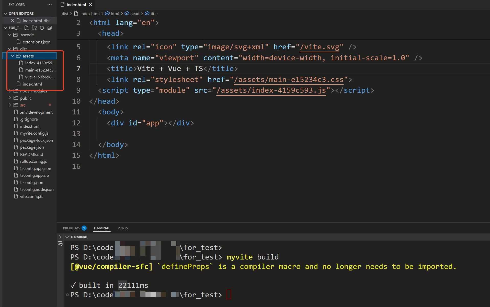
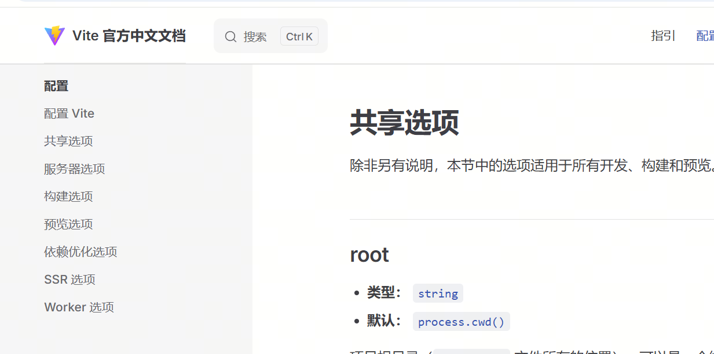
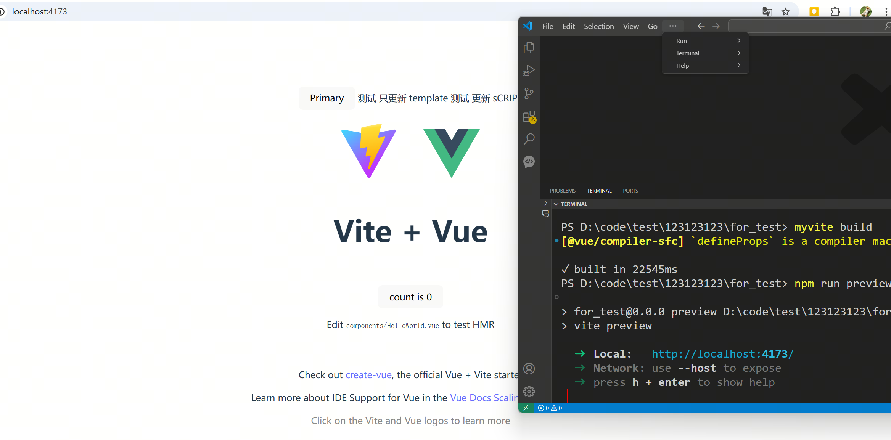

# 重新学习前端工程化：手搓 Vite(三)  

> **有些事，不亲自动手，你永远不会知道它有多简单——或者多难！**  
> 今天，我们不做 Vite 的搬运工，而是尝试亲手造一个迷你版，巩固一下前端工程化的知识。  

## 🎯 本次目标

- **实现 `myvite build` 命令**，用于构建 Vue + TypeScript 项目。
- **使用 Rollup 进行打包**，确保最终生成的产物可在浏览器中正常运行。
- **打包后的文件可直接放入 Web 服务器**，并能正确加载和执行。

---

## ⚙️ **Rollup 的基础配置**

Vite 在生产环境下，默认是使用 **Rollup** 进行项目打包的。因此，我们也将基于 Rollup 来编写一个简化版的构建脚本。

``` javascript
// build.js

// 省略了依赖的引用

const BUILD_HTMLTITLE = 'App'

async function createBuild(root, config) {
  const { outDir, assetsDir='assets' } = config.build

  const template = path.join(config.root, 'index.html')
  if (!fs.existsSync(template)) {
    throw new Error('No index.html found in root directory')
  }

  const dir = path.join(root, outDir || 'dist')
  const main = '/src/main.ts'
  const input = path.join(root, main)

  const inputOptions = {
    input,
    plugins: [
      // 在构建前删除 dist 目录下的所有文件
      del({ targets: outDir }),
      // 可以代码中使用 @ 别名
      alias({
        '@': fileURLToPath(new URL('./src', import.meta.url))
      }),
      // 解析 .vue 文件为 sfc
      vue(),
      // 处理css
      styles({
        mode: 'extract',
        minimize: true,
      }),
      // esbuild，这里用来编译 TypeScript
      esbuild({ target: 'esnext', loader: 'ts' }), // 使用 esbuild 编译 TypeScript
      // rollup 能够识别和处理 npm 包
      resolve(),
      // 将代码中的 process.env.NODE_ENV 替换为 production
      replace({
        preventAssignment: true,
        'process.env.NODE_ENV': JSON.stringify('production'),
      }),
      // rollup 能够识别 commonjs 模块
      commonjs(),
      // 处理图片
      url({
        include: ['**/*.svg', '**/*.png', '**/*.jpg', '**/*.gif'],
        limit: 0,
        fileName: `./${assetsDir}/[name]-[hash][extname]`,
      }),
      // 处理 html 文件。这里为了 html 文件中引入编译新生成的 css 和 js 文件。并删除对开发环境的 css 和 js 的引入
      html({
        title: BUILD_HTMLTITLE,
        template: async ({ files }) => {
          // files 是一个对象，包含了 entrypoints 生成的所有文件
          // 我们需要把他们按顺序引入到 html 模板中

          let code = fs.readFileSync(template).toString()
          code = code.replace(`<script type="module" src="${main}"></script>`, '')

          let fileTags = []
          if (files.css) {
            const cssTags = files.css.map((item) => {
              return '\t' + `<link rel="stylesheet" href="/${item.fileName}">`
            })
            fileTags = [...fileTags, ...cssTags]
          }
          if (files.js) {
            const jsTags = files.js.map((item) => {
              return (
                '\t' + `<script type="module" src="/${item.fileName}"></script>`
              )
            })
            fileTags = [...fileTags, ...jsTags]
          }
          if (fileTags.length) {
            code = code.replace('</head>', fileTags.join('\n') + '\n</head>')
          }
          return code
        },
      }),
      // 压缩 js 文件
      terser()
    ],
  }
  const outputOptions = {
    dir,
    format: 'es',
    entryFileNames: `${assetsDir}/index-[hash].js`,
    assetFileNames: `${assetsDir}/[name]-[hash].[ext]`,
    chunkFileNames: `${assetsDir}/[name]-[hash].js`,
  }
  const start = Date.now()
  const bundle = await rollup(inputOptions)
  await bundle.write(outputOptions)
  await bundle.close()
  const end = Date.now()
  console.log(`✓ built in ${Math.round(end - start)}ms`)
}

export { createBuild }
```

在 `index.js` 中配置 `build` 命令

``` javascript
// index.js

if (mode === 'build') {
  const { createBuild } = await import('./build.js')
  createBuild(root, config)
} else if (mode === 'dev' || mode === 'serve') {

```

打包测试结果如下：



从截图可以看出，Rollup 已经成功执行了打包操作，并输出了对应的构建产物。  

不过，目前这只是最基础的默认配置，还没有应用配置文件，接下来我们需要继续实现这个逻辑

## 📌 **使用 Vite 的配置**

在继续优化 Rollup 构建之前，我们先研究一下 Vite 默认的构建配置。  
以下是一个 Vite 处理 Vue3 + TypeScript 项目的基础配置示例：

``` javascript
// vite.config.ts

import { defineConfig } from 'vite'
import vue from '@vitejs/plugin-vue'
import vueJsx from '@vitejs/plugin-vue-jsx'
import { fileURLToPath, URL } from 'node:url'

export default defineConfig((config) => {
  return {
    build: {
      rollupOptions: {
        input: {
          normal: 'index.html'
        },
        // 静态资源分类打包
        output: {
          chunkFileNames: 'static/js/[name]-[hash].js',
          entryFileNames: 'static/js/[name]-[hash].js',
          assetFileNames: 'static/[ext]/[name]-[hash].[ext]'
        }
      }
    },
    plugins: [vue(), vueJsx(), terser()],
    resolve: {
      alias: {
        '@': fileURLToPath(new URL('./src', import.meta.url))
      }
    }
  }
})
```

在正式开发前，我们先通过官方文档分析 Vite 配置的作用。

)


对于本次构建，我们主要关注 **共享选项** 和 **构建选项**

结合 Vite 与 Rollup 官方文档，我们整理了一些关键的基础配置：


### 🌍 **共享选项（Common Options）**
这些选项适用于 **开发环境和生产环境**，主要影响项目的结构和模块解析方式。

- **`root`**：指定项目的根目录，通常是 `index.html` 文件所在的位置。
- **`plugins`**：定义 Vite 插件列表，可用于扩展功能（如 Vue 解析、TypeScript 支持）。
- **`resolve.alias`**：设置路径别名（例如 Vue 项目中常见的 `@` 代表 `src` 目录）。

---

### 📦 **构建选项（Build Options）**
这些选项主要影响 **生产环境** 下的打包方式。

- **`build.outDir`**：指定构建输出目录，通常默认为 `dist`。
- **`build.assetsDir`**：设置静态资源存放目录（相对于 `build.outDir`）。
- **`build.rollupOptions`**：自定义底层的 Rollup 配置，包括：
  - **`input`**：指定 Rollup 入口文件（通常是 `index.html`）。
  - **`output.chunkFileNames`**：用于代码分割时，动态生成的 chunk 文件的命名规则。
  - **`output.entryFileNames`**：指定入口文件的输出命名规则。
  - **`output.assetFileNames`**：定义静态资源（CSS、图片等）的文件命名方式。
  - **`plugins`**：用于自定义 Rollup 插件列表，以扩展构建能力。

---

在 Vite 配置中，部分 **共享选项（Common Options）** 直接影响 **构建选项（Build Options）**。因此，在构建时，我们需要将某些共享选项映射到 `build.rollupOptions` 中

### 📌 **关键配置映射**
1. **`root`** 影响 **`build.rollupOptions.input`**  
   - `root` 作为项目根目录，会影响 Rollup 查找入口文件的 **相对路径**。

2. **`plugins`** 影响 **`build.rollupOptions.plugins`**  
   - `plugins` 主要用于 Vite 开发环境，但在构建时，也可能需要 **替换** 或 **拆分** 部分插件。

3. **`resolve.alias`** 影响 **Rollup 的 alias 配置**  
   - Vite 的 `resolve.alias` 需要映射到 Rollup 的 `alias` 插件，以确保构建时路径解析一致。

### ✨ **优化思路**
为了简化配置迁移，我们可以编写一个 **转换函数**，将 **共享选项** 复制到 **构建选项** 中，并提供合理的默认值。例如：
- **自动填充 `build.rollupOptions.input`**  
- **合并 `plugins`，以确保 Rollup 正确解析 Vue、TypeScript 等**
- **调整 `resolve.alias`，使 Rollup 也能使用路径别名**

这样，我们就能确保 **开发环境和构建环境的配置尽可能保持一致**，避免额外的手动配置调整。


``` javascript
// config.js

const OPTIMIZER_PATH = '/node_modules/.myvite/deps'
const CLIENT_FILE = 'client.js'
const CLIENT_PATH = `/@myvite/${CLIENT_FILE}`

const defaultConfig = {
  root: '',
  server: {
    host: 'localhost',
    port: 5173,
  },
  build: {
    outDir: 'dist',
    assetsDir: 'assets',
    rollupOptions: {
      input: '',
      output: {
        format: 'es',
        chunkFileNames: 'assets/js/[name]-[hash].js',
        entryFileNames: 'assets/js/[name]-[hash].js',
        assetFileNames: 'assets/[ext]/[name]-[hash].[ext]',
      }
    }
  },
  plugins: [],
  resolve: {
    alias: void 0
  }
}

function getConfigPath(root) {
  for (const file of fs.readdirSync(root)) {
    if (file.includes('vite.config')) {
      return path.join(root, file)
    }
  }

  throw new Error('No myvite.config.js found in root directory')
}

function resolveDevConfig(config) {
  return config
}

function resolveProdConfig(config) {
  // 这里只是简单处理几个参数
  function findInputInRoot(root) {
    const rootPath = path.join(root, 'src')
  
    for (const file of fs.readdirSync(rootPath)) {
      if (file.startsWith('main')) {
        return path.join(rootPath, file)
      }
    }
  
    throw new Error('No entry file found in src directory')
  }
  
  // 没有设置input的一个简单处理
  if (!config.build.input) {
    config.build.input = findInputInRoot(config.root)
  }
  // 这里应该考虑下多入库的情况（函数、对象、数组）。这里只是简单处理
  config.build.input = path.join(config.root, config.build.input)

  if (!config.build.rollupOptions.input) {
    config.build.rollupOptions.input = findInputInRoot(config.root)
  }

  // 没有设置output dir的一个简单处理
  if (!config.build.rollupOptions.output.dir) {
    config.build.rollupOptions.output.dir = path.join(config.root, config.build.outDir || 'dist')
  }

  return config
}

async function createConfig(root, env='dev') {
  defaultConfig.root = root

  const importConfig = (
    await import(pathToFileURL(getConfigPath(root)).href)
  ).default

  // 将默认配置和导入配置合并
  const config = merge(defaultConfig, importConfig)
  return env === 'prod' ? resolveDevConfig(config) : resolveProdConfig(config)
}

export { createConfig, OPTIMIZER_PATH, CLIENT_PATH, CLIENT_FILE }
```


``` javascript
// devServer.js

// 省略依赖的引用

const BUILD_HTMLTITLE = 'App'

function resolvePlugins(userPlugins) {
  const prePlugins = []
  const normalPlugins = []
  const postPlugins = []

  // 这里主要使用插件的两个属性
  // enforce: 'pre' | 'post' | void
  // name: string
  // 通过 enforce 来区分插件的执行顺序
  // 通过 name 来区分插件的唯一性。如果客户设置了和默认插件重名的插件，那么默认插件会被覆盖
  // 这里没有考虑插件覆盖。。
  for (const plugin of userPlugins) {
    if (plugin.enforce === 'pre') {
      prePlugins.push(plugin)
    } else if (plugin.enforce === 'post') {
      postPlugins.push(plugin)
    } else {
      normalPlugins.push(plugin)
    }
  }

  return [prePlugins, normalPlugins, postPlugins]
}

async function createBuild(root, config) {
  const { outDir, assetsDir='assets' } = config.build

  const template = path.join(config.root, 'index.html')
  if (!fs.existsSync(template)) {
    throw new Error('No index.html found in root directory')
  }

  const mainFile = path.basename(config.build.rollupOptions.input)

  const [prePlugins, normalPlugins, postPlugins] = resolvePlugins(config.plugins || [])

  const inputOptions = {
    input: config.build.rollupOptions.input,
    plugins: [
      // 这里存的都是绝对不会修改的插件。理论上都不支持配置
      // 这里写的只是示例
      // 在构建前删除 dist 目录下的所有文件
      del({ targets: outDir }),
      // 注释以下两个，使用用户配置的插件
      // // 可以代码中使用 @ 别名
      // alias(),
      // // 解析 .vue 文件为 sfc
      // vue(),
      // 存储的客户配置的前置执行的插件
      ...prePlugins,
      // 存储的客户配置的正常顺序执行的插件
      ...normalPlugins,
      // 处理css
      styles({}), // 省略插件的配置
      // esbuild，这里用来编译 TypeScript
      esbuild({ target: 'esnext', loader: 'ts' }), // 使用 esbuild 编译 TypeScript
      // rollup 能够识别和处理 npm 包
      resolve(),
      // 将代码中的 process.env.NODE_ENV 替换为 production
      replace({}), // 省略插件的配置
      // rollup 能够识别 commonjs 模块
      commonjs(),
      // 处理图片
      url({}), // 省略插件的配置
      // 处理 html 文件。这里为了 html 文件中引入编译新生成的 css 和 js 文件。并删除对开发环境的 css 和 js 的引入
      html({}), // 省略插件的配置
      // 存储的客户配置的后置执行的插件
      ...postPlugins,
      // 压缩 js 文件
      terser(),
      // 将 public 目录下的所有文件拷贝到 dist 目录
      copy({
        targets: [{ src: 'public/**/*', dest: outDir }]
      })
    ]
  }

  const start = Date.now()
  const bundle = await rollup(inputOptions)
  await bundle.write(config.build.rollupOptions.output)
  await bundle.close()
  const end = Date.now()
  console.log(`✓ built in ${Math.round(end - start)}ms`)
}

export { createBuild }
```

现在，就是最后一步



🎉 手搓 Vite 之旅告一段落！

从零开始，我们一步步拆解 Vite 的核心功能，实现了开发服务器、HMR、构建打包等关键环节。通过这次实践，相信你对 Vite 的工作原理有了更深的理解，也能更好地运用到实际项目中。

这是我第一次正式写专题文章，如果有哪里讲解得不够清晰，或者有可以改进的地方，欢迎直接指出，我也会持续优化内容。

如果这篇文章对你有所帮助，记得点个 关注 🚀✨
