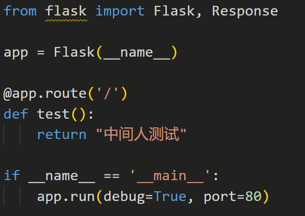
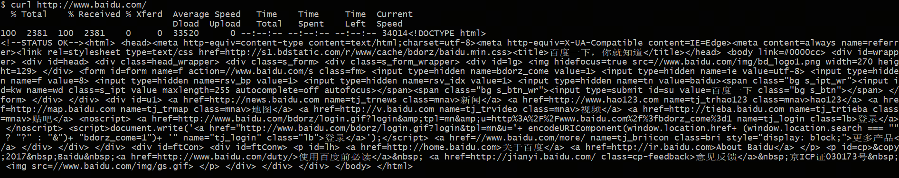
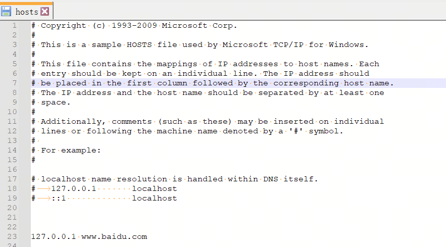
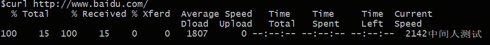

在项目中，我们遇到了一些与 **TLS** 及 **证书** 相关的问题。在与后端同事沟通的过程中，发现大家对于 **TLS 的详细流程** 以及 **证书信息** 的理解仍然存在一些不足。  

为了提升团队对 TLS 及证书的理解，我整理了一些内部分享会的内容，希望帮助大家更系统地掌握这些知识。在这个过程中，我也重新学习了一遍 TLS 的核心概念与实践。  

因此，这里整理了这份学习笔记，与大家分享，希望对你有所帮助。  

## 文章大纲  

### 1. 什么是 TLS？它解决了什么问题？  
   - 为什么需要 TLS？
   - TLS 需要有什么功能？
   - 实现 TLS 需要生成些什么

### 2. 学习 TLS 需要掌握的核心概念  
   - **加密与解密**  
     - 对称加密（AES）  
     - 非对称加密（RSA、ECC）  
   - **哈希函数与消息认证码（MAC）**  
     - 哈希算法（SHA-256 等）  
     - HMAC 的作用与应用  
   - **X.509 证书**  
     - 证书的结构与内容解析  
     - 证书链与 CA（证书颁发机构）  

### 3. TLS_RSA 及其安全性问题  
   - RSA 交换密钥的流程  
   - 前向安全性

### 4. DH 算法及其在 TLS 中的应用
   - **TLS_DH**（基于 Diffie-Hellman 交换密钥）
   - **TLS_DHE**（支持临时密钥的 Diffie-Hellman）

### 5. 椭圆曲线 Diffie-Hellman（ECDH、ECDHE）
   - **TLS_ECDH**（基于椭圆曲线的 DH）
   - **TLS_ECDHE**（支持前向安全的 ECDH）

### 6. 密码套件（Cipher Suites）
   - TLS 密码套件的组成部分

### 7. 证书对密码套件的影响
   - 证书类型如何影响 套件选择？
   - 为什么有些密码套件与某些证书不兼容？
   - 为何有时候要主动配置套件

### 8. 完整的 TLS 流程解析  
   - TLS 握手过程（TLS 1.2）
   - 这些步骤，能不能省略

### 9. TLS 1.3 的优化
   - TLS 1.3 相较于 TLS 1.2 的主要改进
   - 0-RTT 握手优化 是什么

## 1. 什么是 TLS？它解决了什么问题？

在这个数字化时代，我们每天都在网上冲浪、聊天、购物，甚至是“云撸猫”。但你有没有想过，当你在浏览器输入密码、信用卡信息，或者给朋友发个“秘密”消息时，这些数据是怎么在网络上传输的？它安全吗？会不会被中途拦截？

这就要靠 **TLS**（Transport Layer Security，传输层安全协议）来保驾护航了！

### 为什么需要 TLS？

首先，TLS 是为了解决网络通信中的安全问题，其中最典型的就是 **中间人攻击（Man-in-the-Middle, MITM）**。

黑客可以伪装成 WiFi 热点、劫持网络流量，让你的数据先“路过”他的服务器再送到目的地。你以为自己在和银行聊天，其实黑客正偷看你的每个字！TLS 通过 **加密** 和 **身份认证** 解决了这个问题，同时还能防止数据在传输过程中被篡改，确保通信的完整性和可靠性。

为了更直观地理解 **中间人攻击（MITM）**，我们来做一个简单的实验，看看如何拦截并修改用户的请求数据。

1. 启动本地服务

我们先在本地启动一个 Web 服务器，作为“假冒网站”：

2. 正常访问百度

在未受攻击的情况下，我们直接访问百度，可以看到它正常返回数据：

3. 进行 DNS 劫持

我们可以通过 **修改 `hosts` 文件**，让本地的 DNS 解析出错误的 IP 地址。中间人攻击的方式很多，这里只是选择了一个比较简单的方法。
例如，我们把 `baidu.com` 解析到自己的本地服务器：

4. 访问被劫持的百度

当我们再次访问百度时，浏览器实际上已经请求到了我们伪造的本地服务器，而不是真正的百度服务器。此时，我们可以 **窃取请求数据**，甚至 **修改返回内容**：

---

通过这个简单的实验，我们可以看到 **没有 TLS 保护的情况下，攻击者可以轻松劫持用户的网络请求，窃取或篡改数据**。这就是 **中间人攻击（MITM）** 的基本原理。

**而 TLS 通过加密和身份验证机制，能够防止这样的攻击，确保用户真正访问的是可信网站，同时防止数据被篡改！**

### TLS 需要有什么功能？

TLS 主要解决以下几个关键问题：

- **加密（Encryption）**：让你的数据变得“天书一般”，只有真正的接收者能解密阅读。
- **身份验证（Authentication）**：确认对方是不是“真货”，防止你把密码交给了“李鬼”网站。
- **完整性（Integrity）**：确保数据在传输途中没被人偷偷篡改，不然你发个“转 100 元”，黑客改成了“转 10,000 元”，岂不是亏大了？

### 实现 TLS 需要生成些什么？

为了让 TLS 正常运作，它需要 **一整套武器库**，确保 **加密**、**完整性** 和 **身份认证** 都能生效：

#### **1. 加密算法**
TLS 需要确保数据不会泄露，常用的手段是：
- **对称加密**（AES）：用于加密数据传输，高效且安全。

#### **2. 加密密钥**
TLS 握手时，客户端和服务器会协商出一个**临时密钥**，用于加解密密
- **预主密钥**：**
TLS 握手时，客户端和服务器会协商出一个**临时密钥**，叫做 **预主密钥**。这个密钥不会直接用于加密，而是作为种子，结合其他参数（比如随机数），生成最终的会话密钥。

#### **3. 完整性保护**
TLS 需要确保数据没有被篡改，常用的手段是：
- **HMAC（消息认证码）**：用哈希算法（SHA-256 等）计算一个数据签名，接收端可以用它验证数据完整性。
- **盐（Salt）**：为了防止攻击者重放旧的加密数据，同样由 **预主密钥** 加随机数生成

#### **4. 证书**
为了防止中间人攻击，TLS 需要验证对端身份。当然大部分只验证了服务器端
- **X.509 证书**：由 CA（证书颁发机构）签发，证明对端是“正版”而不是“山寨货”。

### 2. 学习 TLS 需要掌握的核心概念

在深入了解 TLS 之前，我们需要掌握一些核心概念。这些概念为我们理解加密、数据保护以及证书验证提供了基础。

#### **加密与解密**

加密是将明文数据转化为密文的过程，解密则是将密文转化为明文。TLS 使用加密技术来确保数据的机密性和完整性，防止数据在传输过程中被泄露或篡改。我们可以把加密过程理解为“天书化”数据，只有拥有密钥的人才能阅读。

**1. 对称加密（AES）**  
对称加密使用相同的密钥进行加密和解密。它的优点是速度快，适合用于大量数据的加密。**AES**（Advanced Encryption Standard，高级加密标准）是常用的对称加密算法，它保证了数据传输的安全性。  
但问题是，如果密钥被泄露，那么加密的数据也就不再安全。因此，TLS 通常会使用对称加密与非对称加密的结合，充分发挥各自的优势。

**2. 非对称加密（RSA、ECC）**  
非对称加密使用一对密钥：一个公开的“公钥”和一个私有的“私钥”。数据用公钥加密后，只有对应的私钥才能解密。**RSA**（Rivest-Shamir-Adleman）和**ECC**（Elliptic Curve Cryptography，椭圆曲线加密）是两种常见的非对称加密算法。  
RSA 在 TLS 1.2 及之前广泛使用，但随着 ECC 的出现，它因效率更高、密钥长度更短而逐渐取代了 RSA，尤其是在移动设备和低带宽环境中。

#### **哈希函数与消息认证码（MAC）**

哈希函数将输入的任意长度数据映射为固定长度的输出（通常是一个哈希值）。在 TLS 中，哈希函数用于验证数据的完整性，防止数据在传输过程中被篡改。

**1. 哈希算法（SHA-256 等）**  
**SHA-256** 是一种常见的哈希算法，它将数据压缩成 256 位的哈希值。任何改变输入数据的内容，都会导致哈希值的变化。因此，哈希算法在数据完整性验证中非常重要，TLS 用它来确保传输中的数据没有被篡改。

**2. HMAC 的作用与应用**  
**HMAC**（Hash-based Message Authentication Code，基于哈希的消息认证码）结合了哈希算法和一个密钥，用于验证消息的完整性并确保消息来源的真实性。在 TLS 中，HMAC 是用来生成密文的标签，保证数据的完整性。即使是恶意攻击者，只要不知道密钥，就无法伪造消息认证码，保证了数据的安全。

#### **X.509 证书**

X.509 证书是 TLS 中重要的组成部分，通常用于实现身份验证，确保通信的对方是可信的。

**1. 证书的结构与内容解析**  
一个 X.509 证书包含了公钥、证书持有者信息、证书颁发机构（CA）的签名等信息。其结构大致如下：
- **版本号**：表示证书的版本。
- **序列号**：证书的唯一标识符。
- **签名算法**：用于签名证书的算法（如 SHA-256）。
- **公钥**：用于加密数据或验证签名的公钥。
- **证书持有者信息**：包含组织名称、国家代码等信息，用来验证证书的归属。
- **证书颁发机构（CA）**：由受信任的证书颁发机构签发，用于验证证书的真实性。

**2. 证书链与 CA（证书颁发机构）**  
证书链是指一组由证书颁发机构签发并相互验证的证书。客户端在验证服务器证书时，会检查证书链，确保证书由受信任的根证书颁发。  
- **根证书**：由最顶层的证书颁发机构（CA）签发，通常内置在操作系统或浏览器中。
- **中间证书**：由根证书颁发，通常用于建立到最终服务器证书的信任链。
- **服务器证书**：由中间证书颁发，表示网站的公钥并用于加密通信。

通过证书链的验证，TLS 能够确保与服务器的通信是真正的、可信任的，防止中间人攻击（MITM）。
